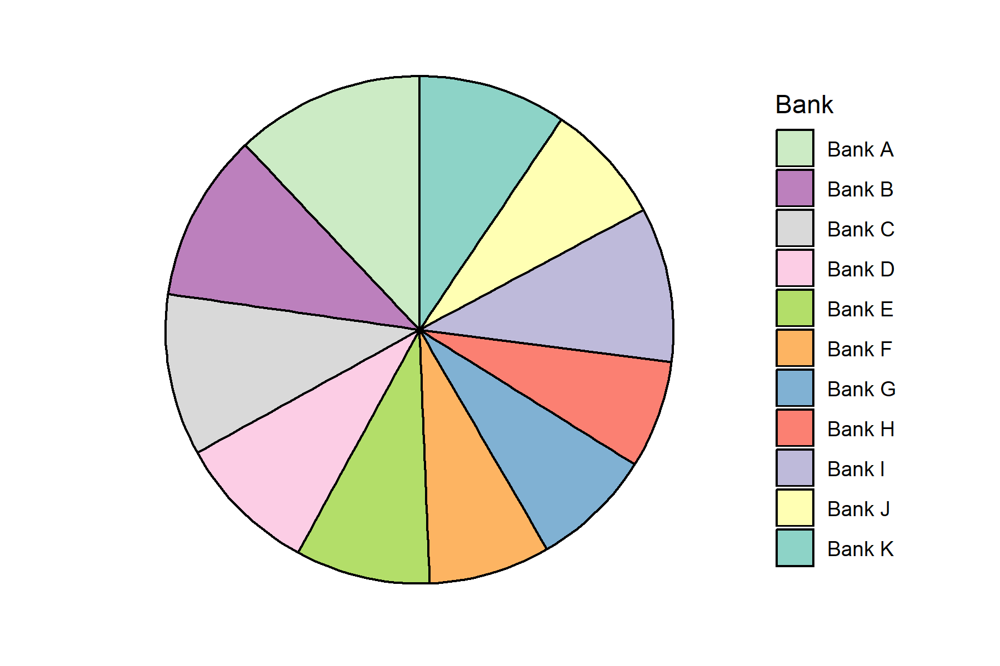
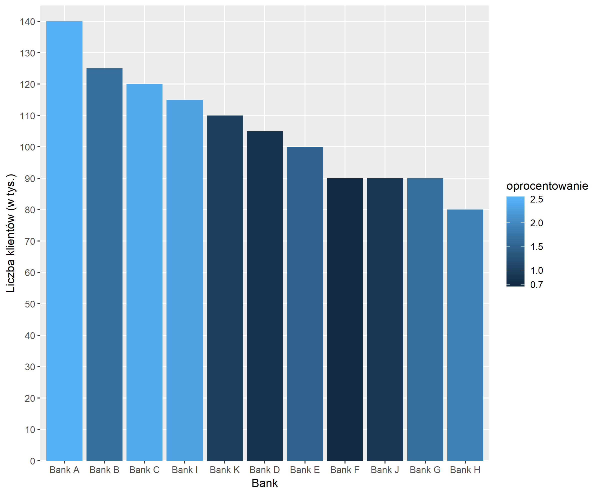
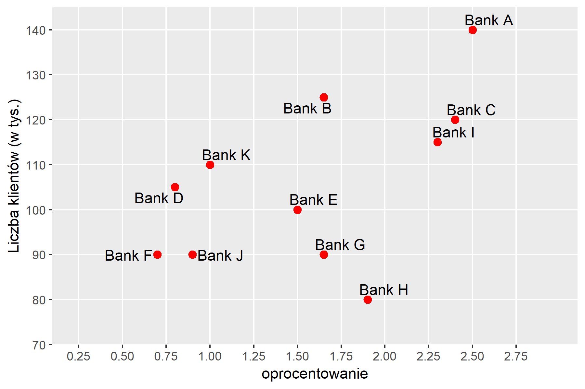

```{r setup, include=FALSE}
knitr::opts_chunk$set(echo = FALSE)
library(ggplot2)
library(dplyr)
odp <- read.csv("odpowiedzi.csv")
```

# Problemy z odczytywaniem danych na wykresach
## Opis eksperymentu
W ramach eksperymentu przeprowadziłem ankietę ([link](https://goo.gl/forms/2S8KX4qLs5h5WuuI2)) na grupie 16 osób. Ankieta zawierała 6 pytań sprawdzających:

* Z którego wykresu łatwiej odczytać dane - kołowego czy słupkowego?
* Czy iluzje optyczne utrudniają odczytywanie danych?
* Co jest lepsze do przedstawienia trójwymiarowych danych - słupki z kolorami czy punkty z podpisam?

Dane zostały wymyślone na potrzeby wizualizacji.

## Wykres kołowy vs wykres słupkowy
Pierwsze pytanie sprawdzało czy łatwo jest odczytać dane z wykresu kołowego.
Uczystnicy mieli wskazać bank mający największy wycinek koła.



```{r}
odp1 <- odp[,c(1,2)] %>% count(pyt1 = factor(pyt1)) %>% ungroup() %>% mutate(pyt1_procent = prop.table(n)*100)
ggplot(odp1, aes(x=pyt1, y= pyt1_procent, label=paste0(pyt1_procent,"%"))) + 
  geom_bar(stat="identity", fill=c("green", rep("red",3))) +
  geom_label() +
  ylab("Procent udzielonych odpowiedzi") +
  xlab("Wskazana odpowiedź") +
  labs(title="Odpwiedzi na pytanie 1")

```

Poprawną odpowiedź wskazało zaledwie 62,5% ankietowanych. 
Na to samo pytanie z danym wykresem słupkowym 100% ankietowanych odpowiedziało dobrze.
**Wniosek: ** wykresy słupkowe są łatwiejsze do odczytania niż wykresy kołowe, które często mogą wprowadzać w błąd, gdyż ciężej porównywać kąty niż wysokości słupków.

## Iluzje optyczne - czy warto używać kolorów?
W pytanu 3. poproiłem ankietowanych o stwierdzenie czy trzy wskazane banki (B, E, G) mają takie samo oprocentowanie, które zostało zakodowane na wykresie za pomocą kolorów - im jaśniejszy tym wyższe oprocenowanie. 



Bank E miał oprocentowanie na poziomie 1.5, a dwa pozostałe 1.65:
```{r}
dane <- read.csv("dane.csv")
dane <- mutate(dane,procent_klientow=klienci/sum(klienci))
dane$Bank <- factor(dane$Bank,levels= dane$Bank[order(dane$klienci,decreasing = TRUE)])
ggplot(dane[c(2,7,10),],aes(x=Bank,y=klienci, fill=oprocentowanie)) + 
  geom_col(width=1) +
  scale_y_discrete(limits = seq(0,140,10), expand=c(0,0,0,5)) +
  ylab("Liczba klientów (w tys.)")+
  scale_fill_continuous(breaks = c(0.7,1,1.5,2,2.5),limits=c(0.8,2.5))

```

```{r}
odp3 <- odp[,c(1,4)] %>% count(pyt3 = factor(pyt3)) %>% ungroup() %>% mutate(pyt3_procent = prop.table(n)*100)
odp3$pyt3 <- factor(odp3$pyt3, labels = c("Tak", "Nie"))
ggplot(odp3, aes(x=pyt3, y= pyt3_procent, label=paste0(pyt3_procent,"%"))) + 
  geom_bar(stat="identity", fill=c("red", "green")) +
  geom_label() +
  ylab("Procent udzielonych odpowiedzi") +
  xlab("Wskazana odpowiedź") +
  labs(title="Odpwiedzi na pytanie 3")

```

Aż 50% ankietowanych uległo złudzeniu optycznemu i wskazało złą odpowiedź. 

Następne pytanie było już bardziej szczegółowe - pytałem o to który z omawianych trzech banków ma niższe oprocentowanie.

```{r}
odp4 <- odp[,c(1,5)] %>% count(pyt4 = factor(pyt4)) %>% ungroup() %>% mutate(pyt4_procent = prop.table(n)*100)
ggplot(odp4, aes(x=pyt4, y= pyt4_procent, label=paste0(pyt4_procent,"%"))) + 
  geom_bar(stat="identity", fill=c("red", "green", "red")) +
  geom_label() +
  ylab("Procent udzielonych odpowiedzi") +
  xlab("Wskazana odpowiedź") +
  labs(title="Odpwiedzi na pytanie 4")

```

Tym razem już tylko 31,3% osób odpowiedziało poprawnie. Wynikać to mogło z faktu, iż bank E był w sąsiedztwie banków o niższym oprocentowaniu i jego delikatnie ciemniejszy słupe nie wyróżniał się obok jeszcze ciemniejszyh sąsiadów. Natomiast bank B był obok banków o jasnych słupkach, co mogło dać wrażenie, że jest on trochę ciemniejszy.
**Wniosek: ** używanie kolorów do kodowania zbliżonych wartości może prowadzić do błędów w odczytaniu danych, spowodowanych np. iluzją optyczną.

## Co innego zamiast kolorów?
Na wykresie nr 3 przedstawiłem dane z wykresu nr 2 na wykresie punktowym, gdzie osiami X i Y były liczba klientów i oprocentowanie.



Ponownie zapytałem ankietowanych o to, który z podanych trzech banków ma najniższe oprocentowanie.

```{r}
odp5 <- odp[,c(1,6)] %>% count(pyt5 = factor(pyt5)) %>% ungroup() %>% mutate(pyt5_procent = prop.table(n)*100)
odp5 <- rbind(data.frame(pyt5="Bank B", n=0, pyt5_procent=0),odp5)
ggplot(odp5, aes(x=pyt5, y= pyt5_procent, label=paste0(pyt5_procent,"%"))) + 
  geom_bar(stat="identity", fill=c("red", "green", "red")) +
  geom_label() +
  ylab("Procent udzielonych odpowiedzi") +
  xlab("Wskazana odpowiedź") +
  labs(title="Odpwiedzi na pytanie 5")

```

Tym razem 15 z 16 odpowiedzi(93,8%) było poprawnych.
**Wniosek:** wykres punktowy z podpisami lepiej przedstawia dane trójwymiarowa niż wykres słupkowy z kolorami.

##Podsumowanie
Mimo że ankieta była przeprowadzona na małej liczbie osób, wyniki pokazały, że omawiane "dobre praktyki" faktycznie wpływają na czytelność wykresów i efektywność przekazywania informacji.