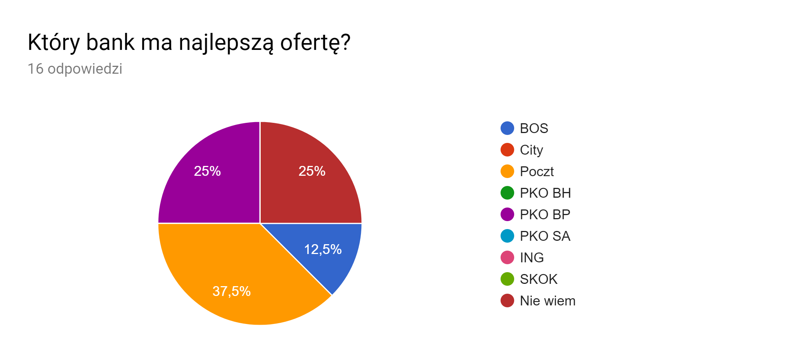
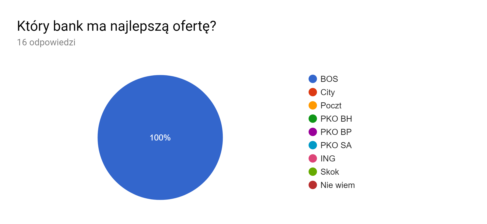
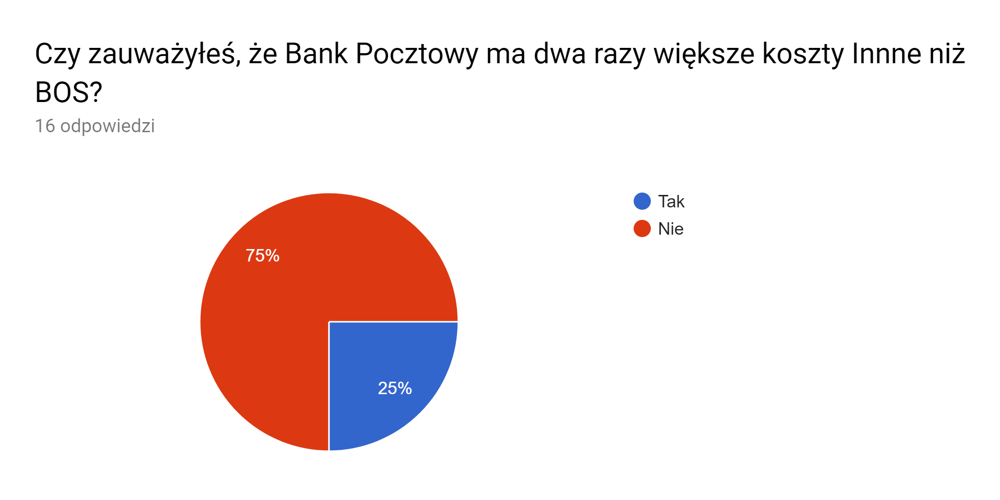
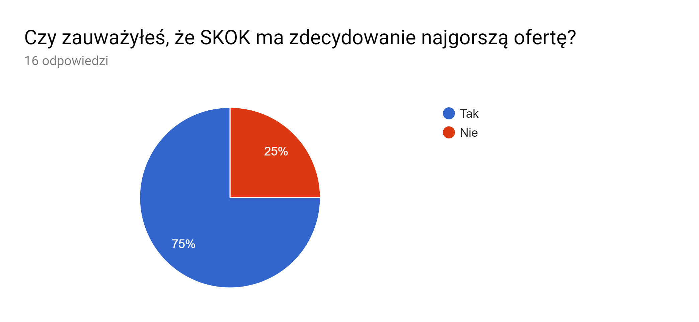
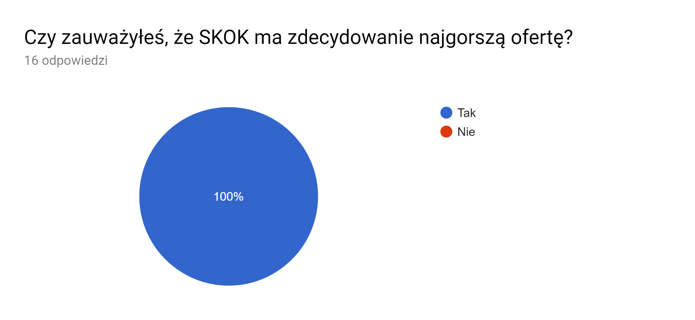

```{r setup, include=FALSE}
knitr::opts_chunk$set(echo = TRUE)
library(data.table)
library(ggplot2)
library(latticeExtra)
```

## Cel zadania

Celem zadania by³o zbadanie, czy w spo³eczeñstwie wystêpuj¹ problemy z czytaniem wykresów przygotowanym nie trzymaj¹c siê dobrych praktych. 

## Przygotowany eksperyment

Na potrzeby zadania przygotowano dwa wykresy. Pierwszy z nich, mimo i¿ przedstawia te same dane jest niepoprawny, bo przygotowany bez uwzglêdnienia dobrych praktyk. Drugi zosta³ przygtowany znacznie bardzie starannie, tak aby by³ bardziej czytelny. Inspiracj¹ do zadania by³a jedna z poprawionych prac domowych oraz pewnien wykres znaleziony na stackoverflow. W ramach eksperymentu pokazano badanym pierwszy, niepoprawny wykres i zadano trzy pytania, na które odpowiedŸ by³a trudna. Potem przedstawiono ankietyzowanemu drugi wykres i zadano ponownie te same pytania. Dane u¿yte w zadaniu by³y prawdziwe, z jednym wyj¹tkiem. Dodano jeden bank (nie istniej¹cy ju¿) ze znacznie gorsz¹ ofert¹ od razu rzucaj¹c¹ w oczy.

## Pierwszy wykres
W przygotowanej ankiecie wykres by³ wiêkszy, wiêc nazwy bankóW siê nie zlewa³y.

```{r 1}
dt <- data.table(read.csv2("kredyty.csv", stringsAsFactors=FALSE))
names(dt)[1]<-"Bank"
tmp <- data.table(melt(dt[,-2], id="Bank"))
tmp <- tmp[order(value)]
tmp[,3] <- tmp[,3]/1000
minprice <- min(dt[,2])/1000

tmp$Bank <- factor(tmp$Bank)


cloud(value~Bank+variable, tmp, panel.3d.cloud=panel.3dbars, col.facet='grey', 
      ylab="Typ op³aty", zlab = "tys. zl",
      xbase=0.4, ybase=0.4, scales=list(arrows=FALSE, col=1), 
      par.settings = list(axis.line = list(col = "transparent")))
```

## Drugi wykres

```{r 2}
dt <- data.frame(read.csv2("kredyty.csv", stringsAsFactors=FALSE))
names(dt)[1]<-"Bank"
dt[,2] <- dt[,2] - dt[,6]
dt[,1] <- factor(dt[,1], levels = dt[,1])
dt1 <- dt[,c(1,2)]
dt1[,2] <-dt1[,2] / 1000
dt2 <- dt[, -c(6,2)]
dt2 <- melt(dt2)
dt2[,3] <- dt2[,3] / 1000
dt2$label <- dt1$Koszt
dt2[1:16,4] <- ""

ggplot(dt2, aes(x=Bank, y=value, fill=variable)) +
  geom_bar(stat="identity") +
  geom_text(aes(label = label, y = as.numeric(dt2[,4])),vjust=-0.3, color="black", size=4) +
  labs(y = "Ca³kowity koszt w tys.", title="Koszt kredytów na 300.000 zl na 20 lat") +
  theme_minimal()
```

## Pytania

### 1) Który bank ma najlepsz¹ ofertê?

#### Przewidywania
Wed³ug przewidywañ przy pierwszym wykresie odpowiedzi powinny byæ g³ównie b³êdne, informacjê t¹ bardzo ciê¿ko odczytaæ bez wnikliwej analizy. W drugim przypadku powinniœmy dostaæ w wiêkszoœci prawid³owe odpowiedzi, gdy¿ przy ka¿dym s³upku widnia³a informacja o kosztach, ponadto banki by³y posortowane rosn¹co po tej wartoœci.

#### Odpowiedzi

##### Wykres 1

```{r 11, echo=FALSE, fig.cap="A caption", out.width = '100%'}

```

##### Wykres 2

```{r 12, echo=FALSE, fig.cap="A caption", out.width = '100%'}

```

#### Komentarz
Przy pierwszym wykresie ankietowani raczej nie byli w stanie szybko znaleŸæ prawid³owej odpowiedzi. Czêœæ uzna³a, i¿ inforacji nie da siê odczytaæ i zaznaczali opcjê "nie wiem". Reszta mimo trudnoœci stara³a siê coœ wywnioskowaæ z ró¿nym skutkiem. Mimo wszytsko zdecydowana wiêkszoœæ nie udzieli³a poprawnej informacji. Informuje to nas o powa¿ych trudnoœciach z odczytaniem tej informacji z tego wykresu.  
W drugim przypadku odpowiedzi by³y w 100% trafne. Oznacza to, i¿ dobrze przygotowaliœmy wykres. Najwa¿niejsza informacja zosta³a przez wszytskich odczytana poprawnie.

### 2) Czy zauwa¿y³eœ, ¿e Bank Pocztowy ma dwa razy wiêksze koszty Innne ni¿ BOS?

#### Przewidywania
Pytanie dotyczy³o informacji bardzo ³atwo widocznej na drugim wykresie i trochê trudniej (choæ mo¿liwej do odczytania po przyjrzeniu siê) na wykresie drugim. Oczekujemy, i¿ przy pierwszym podejœciu odsetek ankietowanych, którzy zauwa¿yli tê zale¿noœæ bêdzie znacznie mniejszy ni¿ w drugim przypadku, ale nie koniecznie zerowy.

#### Odpowiedzi

##### Wykres 1

```{r 21, echo=FALSE, fig.cap="A caption", out.width = '100%'}

```

##### Wykres 2

```{r 22, echo=FALSE, fig.cap="A caption", out.width = '100%'}
knitr::include_graphics("2_2.png")
```

#### Komentarz
Zgodnie z oczekiwaniami, kilka osób ktore nie zosta³y zdemotywowanych form¹ pierwszego wykresu i poœwiêci³y kilka sekund wiêcej poradzi³y sobie z zadaniem. Jednak wiêkszoœæ odpowiedzia³a, i¿ nie zauwa¿y³a zale¿noœci. To pokazuje, i¿ w przypadku realnych czytelników znacznie czêœciej wyst¹pi druga sytuacja i takie szczegó³y s¹ zazwyczaj pomijane przy tak nieczytelnej formie. W drugim przypadku równie¿ nie by³o 100% odpowiedzi. Jest to zgodne z oczekiwaniami, gdy¿ wiêkszoœæ osób, które nie stara siê w tej chwili o kredyt, uwa¿a takie informacje za mniej istotne i skupia siê na innych.

### 3) Czy zauwa¿y³eœ, ¿e SKOK ma zdecydowanie najgorsz¹ ofertê?

#### Przewidywania
Ostatnie pytanie dotyczy³o informacji, której zauwa¿enie na pierwszym wykresie by³o ³atwiejsze ni¿ w dwóch poprzednich przypadkach, gdy¿ wszystkie trzy sk³adowe SKOKu s¹ najwy¿sze. Œrednio wnikliwy obserwator bez problemu móg³ je zsumowaæ, ale wymaga to czasu i chêci. Oczekujemy, i¿ w pierwszym przypadku wynik nie bêdzie najgorszy, aczkolwiek w drugim bêdzie lepszy.

##### Wykres 1

```{r 31, echo=FALSE, fig.cap="A caption", out.width = '100%'}

```

##### Wykres 2

```{r 32, echo=FALSE, fig.cap="A caption", out.width = '100%'}

```

#### Komentarz
Zgodnie z oczekiwaniami, sporo osób zauwa¿y³a t¹ informacjê na pierwszym wykresie. W drugim przypadku odsetek ten by³ stuprocentowy.