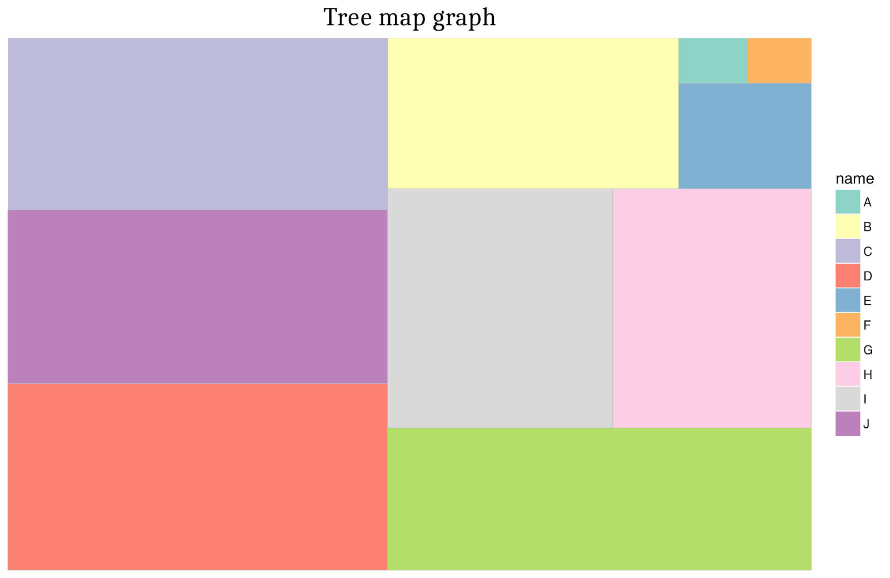
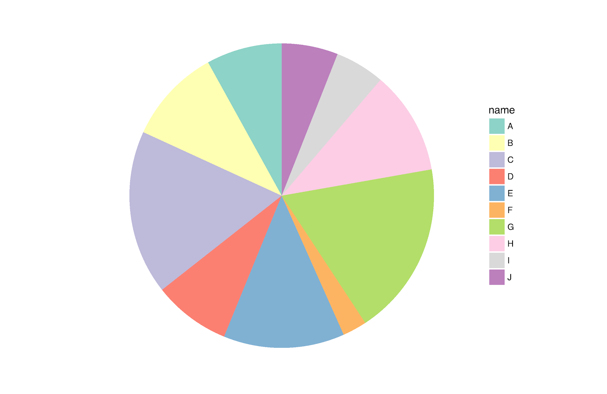
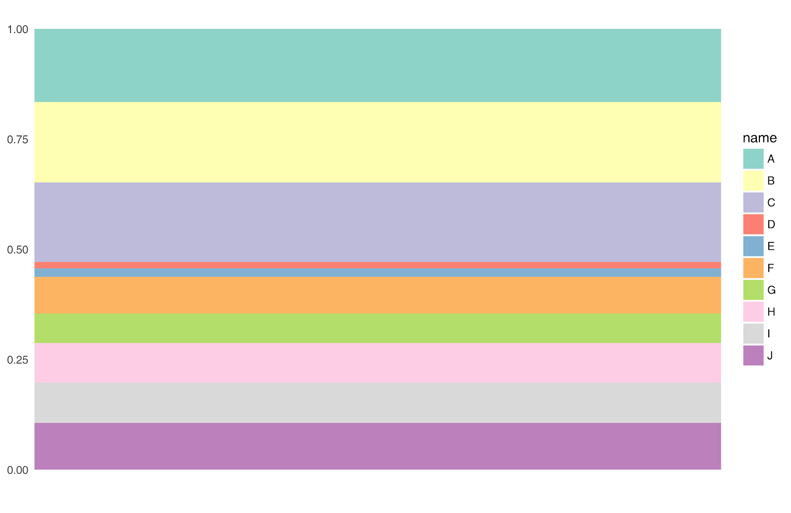
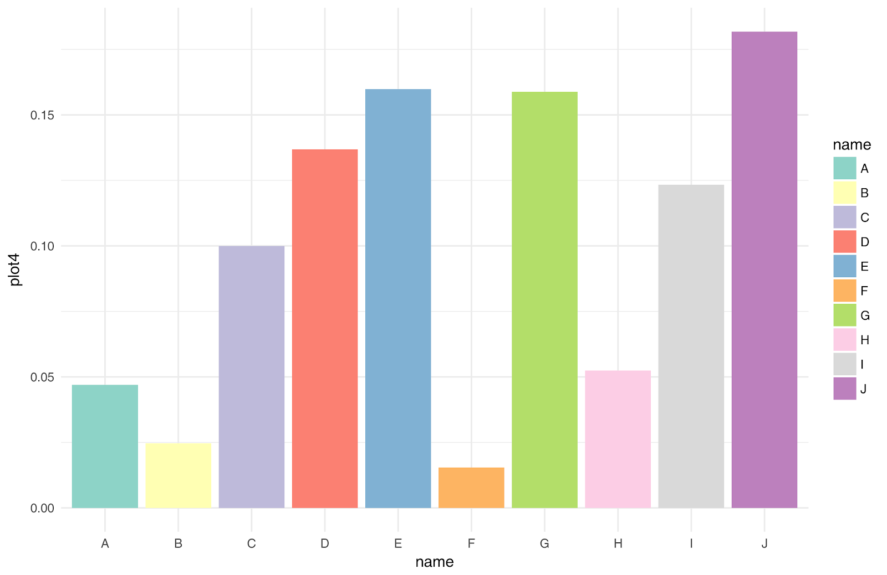
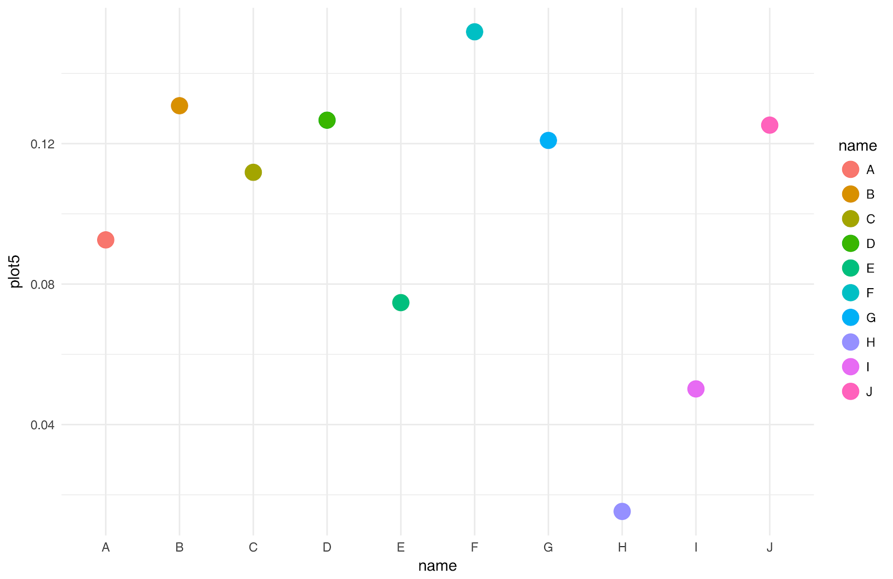

```{r setup, include=FALSE}
library(ggplot2)
library(treemapify)
library(dplyr)
library(reshape)

blank_theme <- theme_minimal()+
  theme(
    axis.title.x = element_blank(),
    axis.title.y = element_blank(),
    panel.border = element_blank(),
    panel.grid=element_blank(),
    axis.ticks = element_blank(),
    plot.title=element_text(size=14, face="bold")
  )

answer <- c(0.1409, 0.0073, 0.1746, 0.0256, 0.0148, 0.1058, 0.0524, 0.0246, 0.0747, 0.0502)

responses <- read.csv("pracaDomowa5.csv", header = TRUE)
a <- matrix(rep(answer,17))
dim(a) <- c(17,10)           
a

error <- responses-a
chart.type <- rep(c("Treemap", "Pie chart", "Stacked bar chart", "Separated bar chart", "Points"), each = 34)
results <- cbind(melt(error), chart.type)
names(results) <- c("question", "error", "chart.type")
results$question <- rep(c("1G","1A","2C","2F","3D","3J","4H","4B","5E","5I"), each = 17)
results$chart.type <- factor(results$chart.type, levels = c("Treemap", "Pie chart", "Stacked bar chart", "Separated bar chart", "Points"))
```

# Wstęp

W swoim eksperymencie postanowiłem zbadać, które wykresy w najlepszy sposób oddają wartości procentowe. W tym celu przygotowałem [Ankietę](https://docs.google.com/forms/d/e/1FAIpQLSdM3IEFLJFM1KkEbZfElf6eZod-UtZsClpdsITjLjnh0_CISg/viewform?usp=sf_link), na której pokazałem pięć rodzajów wykresów i poprosiłem ankietowanych o podanie procentowej wartości udziału dwóch wybranych kategorii. Po otrzymaniu wyników w naprawdę różnych w formatach (oryginalne odpowiedzi można znaleźć w pliku *PracaDomowa5Original.csv*) przetworzyłem je i policzyłem błędy oszacowań onkietowanych. Poniżej możemy zobaczyć te 5 wykresów. Niestety przez przypadek usunąłem dane, za pomocą których je wygenerowałem, ale na szczęście zapisałem zdjęcia samych wykresów. Nad wykresem załączam kod, którym został wygenerowany.

```{r plot1, eval=FALSE}
ggplot(data, aes(area = plot1, fill = name)) +
  geom_treemap() +
  theme(plot.title = element_text(family = "cambria", size = 18, hjust = 0.5)) +
  scale_fill_brewer(palette = "Set3") +
  labs(title = "Tree map graph")

```



```{r plot2, eval=FALSE}
ggplot(data, aes(x="",y=plot2, fill=name)) +
  geom_bar(width = 1, stat = "identity") +
  coord_polar("y", start=0) +
  scale_fill_brewer(palette = "Set3") +
  blank_theme +
  theme(axis.text.x=element_blank())
```



```{r plot3, eval=FALSE}
ggplot(data, aes(x="", y=plot3, fill=name)) +
  blank_theme +
  scale_fill_brewer(palette = "Set3") +
  geom_bar(width = 1, stat = "identity")
```



```{r plot4, eval=FALSE}
ggplot(data, aes(x=name, y=plot4, fill=name)) +
  theme_minimal() + 
  scale_fill_brewer(palette = "Set3") +
  geom_bar(stat = "identity")
```



```{r plot5, eval=FALSE}
ggplot(data, aes(x=name, y=plot5, color=name)) + 
  theme_minimal() +
  geom_point(size = 5)
```



# Wnioski z ankiety

Na podstawie 17 odpowiedzi postanowiłem zobaczyć jaki jest rozkład błędów dla poszczególnego pytania, oznaczając również rodzaj wykresu, przy którym to pytanie zostało zadane. Oprócz tego policzyłem średni błąd kwadratowy odpowiedzi według typu wizualizacji. Z ankiety wynika, że najciężej odczytuje się wartości procentowe z wykresów typu Treemap i Pie chart, a najłatwiej z wykresów słupkowych oraz punktowych. Oprócz tego widać tendencję, że mediana błędów w ankiecie zbliża się do zera. Oznacza to, że bez względu na to jaki wykres wybierzemy, jeżeli będziemy mieli wystarczająco dużo odpowiedzi, będziemy w stanie dokładnie określić wartość procentoweg udziału danej kategorii.

```{r boxplot, fig.width = 10}
ggplot(results, aes(x = question, y = error, color = chart.type)) + 
  geom_boxplot() + 
  labs(title = "Rozkład błędów odgadniętej wartości w zależności od rodzaju wykresu", x = "Pytanie", y = "Błąd odpowiedzi") +
  theme_minimal() +
  theme(axis.title.x = element_text(size = 15), axis.title.y = element_text(size = 15), plot.title = element_text(hjust = 0.5)) +
  scale_color_brewer(palette = "Dark2")
```


```{r mse, fig.width = 10}
results$squared.error <- results$error^2
ggplot(results[,c("squared.error", "chart.type")] %>% group_by(chart.type) %>% summarise(mean=mean(squared.error)), aes(x = chart.type, y = mean, fill = chart.type)) +
  geom_bar(stat = "identity") +
  theme_minimal() +
  labs(title = "Średni błąd kwadratowy odpowiedzi w zależności od rodzaju wykresu", y = "", x = "Rodzaj wykresu") +
  theme(axis.title.x = element_text(size = 15),
        axis.title.y = element_text(size = 15),
        plot.title = element_text(hjust = 0.5),
        axis.text.x = element_blank()) +
  scale_color_brewer(palette = "Dark2")
```

Dla dociekliwych, prawidłowe odpowiedzi to
```
1G, 0.1409
1A, 0.0073
2C, 0.1746
2F, 0.0256
3D, 0.0148
3J, 0.1058
4H, 0.0524
4B, 0.0246
5E, 0.0747
5I, 0.0502
```
