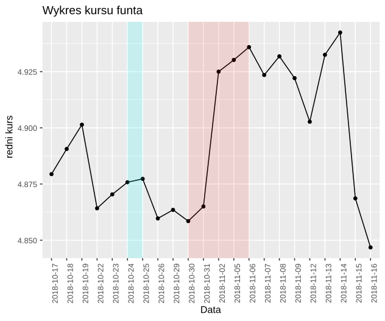

# Wstęp

W tej pracy domowej postanowiłem stworzyć [ankietę](https://goo.gl/forms/ZrmHkQXwg53DLtym2) o prezentacji danych, a dokładnie kursów dolara oraz funta z portalu [money.pl](https://www.money.pl). Utworzyłem dwa wykresy liniowo-punktowe. Skala osi $Y$ pierwszego oscyluje w pobliżu wysokości kursu w danym okresie, natomiast skala osi $Y$ w drugim jest zaczepiona w zerze. 

# Statystyki z komentarzem

### Wykres 1.
<center>
   
</center>

```{r, echo=FALSE}

library(reshape2)
library(ggplot2)


```

```{r, fig.width=10, fig.height=3, echo=FALSE}


dane <- as.data.frame(matrix(c(0, 0, .294, .706), 1, 4))
colnames(dane) <- c("zmienna", "wzrósł", "zmalał", "nie zmienił się")
dane <- melt(dane, id.vars = "zmienna")
ggplot(data = dane, aes(x = dane$zmienna, y = dane$value, fill = dane$variable)) +
  geom_bar(width = 0.1, stat = "identity", position = position_fill(reverse = TRUE)) +
  coord_flip() +
  labs(title = "Jak zachował się kurs w niebieskim okresie?", x = "Wykres 1.", y = "Stosunek odpowiedzi", fill = "Odpowiedź") + 
  geom_text(aes(label=paste0(dane$value*100, "%")), size = c(0, 7, 7), hjust=1.05, position = position_stack(reverse = TRUE), col = "white", fontface = "bold")  +
  theme(axis.title.y = element_text(angle = 0, vjust = 0.5), axis.text = element_blank(), axis.ticks = element_blank(), panel.background = element_blank(), aspect.ratio = 0.15, legend.position = "top", title = element_text(size = 15), legend.text = element_text(size = 12))

```

#### Odp:

`zmalał`

#### Komentarz:

W tej statystyce spodziwałem się bardzo dużej rozbieżności zdań ankietowanych, ponieważ wykres w tym miejscu jest praktycznie płaski. Myślałem, że intuicyjnie ankietowani będą zaznaczać losowo wzrósł lub zmalał, jednakże większość wybrała odpowiedź `nie zmienił się`, a pojawiły się także odpowiedzi poprawne, przy czym nie było w ogóle odpowiedzi `wzrósł`.

```{r, fig.width=10, fig.height=3, echo=FALSE}
dane <- as.data.frame(matrix(c(0, .294, .529, .176, 0, 0), 1, 6))
colnames(dane) <- c("zmienna", "ok. 0,03%", "ok. 0,3%", "ok. 3%", "ok. 30%", "ok. 300%")
dane <- melt(dane, id.vars = "zmienna")
ggplot(data = dane, aes(x = dane$zmienna, y = dane$value, fill = dane$variable)) +
  geom_bar(width = 0.1, stat = "identity", position = position_fill(reverse = TRUE)) +
  coord_flip() +
  labs(title = "Jak bardzo wzrósł kurs w czerwonym okresie?", x = "Wykres 1.", y = "Stosunek odpowiedzi", fill = "Odpowiedź") + 
  geom_text(aes(label=paste0(dane$value*100, "%")), size = c(7, 7, 7, 0, 0), hjust=1.05, position = position_stack(reverse = TRUE), col = "white", fontface = "bold")  +
  theme(axis.title.y = element_text(angle = 0, vjust = 0.5), axis.text = element_blank(), axis.ticks = element_blank(), panel.background = element_blank(), aspect.ratio = 0.15, legend.position = "top", title = element_text(size = 15), legend.text = element_text(size = 12))
```

#### Odp:

`3%`

#### Komentarz:

Wyniki tego pytania całkowicie minęły się z moimi oczekiwaniami. Spodziewałem się, że takie zaprezentowanie danych będzie sprzyjało poprawnej odpowiedzi, jednakże jedynie $17,6\%$ osób trafiło z odpowiedzią. Wypłaszczenie wykresu wywołało tendencję do zaniżania wzrostu kursu w ocenie ankietowanych.

```{r, fig.width=10, fig.height=3, echo=FALSE}
dane <- as.data.frame(matrix(c(0, .882, 0, .118), 1, 4))
colnames(dane) <- c("zmienna", "wzrósł", "zmalał", "nie zmienił się")
dane <- melt(dane, id.vars = "zmienna")
ggplot(data = dane, aes(x = dane$zmienna, y = dane$value, fill = dane$variable)) +
  geom_bar(width = 0.1, stat = "identity", position = position_fill(reverse = TRUE)) +
  coord_flip() +
  labs(title = "Biorąc pod uwagę cały okres przedstawiony na wykresie kurs:", x = "Wykres 1.", y = "Stosunek odpowiedzi", fill = "Odpowiedź") + 
  geom_text(aes(label=paste0(dane$value*100, "%")), size = c(7, 0, 7), hjust=1.05, position = position_stack(reverse = TRUE), col = "white", fontface = "bold")  +
  theme(axis.title.y = element_text(angle = 0, vjust = 0.5), axis.text = element_blank(), axis.ticks = element_blank(), panel.background = element_blank(), aspect.ratio = 0.15, legend.position = "top", title = element_text(size = 15), legend.text = element_text(size = 12))
  
```

#### Odp:

`wzrósł`

#### Komentarz:

W tym przypadku dla zdecydowanej większości osób nie było problemem określenie ogólnego trendu wykresu i 
nie ma w tym nic zaskakującego, jednakże spodziewałem się delikatnie wyższej liczby błędnych odpowiedzi.

### Wykres 2.
<center>

</center>
```{r, fig.width=10, fig.height=3, echo=FALSE}

dane <- as.data.frame(matrix(c(0, 1, 0, 0), 1, 4))
colnames(dane) <- c("zmienna", "wzrósł", "zmalał", "nie zmienił się")
dane <- melt(dane, id.vars = "zmienna")
ggplot(data = dane, aes(x = dane$zmienna, y = dane$value, fill = dane$variable)) +
  geom_bar(width = 0.1, stat = "identity", position = position_fill(reverse = TRUE)) +
  coord_flip() +
  labs(title = "Jak zachował się kurs w niebieskim okresie?", x = "Wykres 2.", y = "Stosunek odpowiedzi", fill = "Odpowiedź") + 
  geom_text(aes(label=paste0(dane$value*100, "%")), size = c(7, 0, 0), hjust=1.05, position = position_stack(reverse = TRUE), col = "white", fontface = "bold")  +
  theme(axis.title.y = element_text(angle = 0, vjust = 0.5), axis.text = element_blank(), axis.ticks = element_blank(), panel.background = element_blank(), aspect.ratio = 0.15, legend.position = "top", title = element_text(size = 15), legend.text = element_text(size = 12))
```

#### Odp:

`wzrósł`

#### Komentarz:

Wykres 2. sprzyja określaniu zachowania się kursu dzięki czemu wszyscy ankietowani odpowiedzieli poprawnie.

```{r, fig.width=10, fig.height=3, echo=FALSE}
dane <- as.data.frame(matrix(c(0, .118, .294, .235, .235, .118), 1, 6))
colnames(dane) <- c("zmienna", "ok. 0,02%", "ok. 0,2%", "ok. 2%", "ok. 20%", "ok. 200%")
dane <- melt(dane, id.vars = "zmienna")
ggplot(data = dane, aes(x = dane$zmienna, y = dane$value, fill = dane$variable)) +
  geom_bar(width = 0.1, stat = "identity", position = position_fill(reverse = TRUE)) +
  coord_flip() +
  labs(title = "Jak bardzo wzrósł kurs w czerwonym okresie?", x = "Wykres 2.", y = "Stosunek odpowiedzi", fill = "Odpowiedź") + 
  geom_text(aes(label=paste0(dane$value*100, "%")), size = c(7, 7, 7, 7, 7), hjust=1.05, position = position_stack(reverse = TRUE), col = "white", fontface = "bold")  +
  theme(axis.title.y = element_text(angle = 0, vjust = 0.5), axis.text = element_blank(), axis.ticks = element_blank(), panel.background = element_blank(), aspect.ratio = 0.15, legend.position = "top", title = element_text(size = 15), legend.text = element_text(size = 12))
```

#### Odp:

`2%`

#### Komentarz:

Ankietowani mieli problem z określeniem jak bardzo podniósł się kurs. Odpowiedzi były skrajnie różne, jednakże $23,5\%$ osób wskazało poprawną odpowiedź, co jest zaskakująco dużą wartością, gdyż określenie wartości wzrostu wymagało dużego zaangażownaia w przeanalizowanie wykresu.

```{r, fig.width=10, fig.height=3, echo=FALSE}
dane <- as.data.frame(matrix(c(0, 0, 1, 0), 1, 4))
colnames(dane) <- c("zmienna", "wzrósł", "zmalał", "nie zmienił się")
dane <- melt(dane, id.vars = "zmienna")
ggplot(data = dane, aes(x = dane$zmienna, y = dane$value, fill = dane$variable, order = dane$variable)) +
  geom_bar(width = 0.1, stat = "identity", position = position_fill(reverse = TRUE)) +
  coord_flip() +
  labs(title = "Biorąc pod uwagę cały okres przedstawiony na wykresie kurs:", x = "Wykres 2.", y = "Stosunek odpowiedzi", fill = "Odpowiedź") + 
  geom_text(aes(label=paste0(dane$value*100, "%")), size = c(0, 7, 0), hjust=1.05, position = position_stack(reverse = TRUE), col = "white", fontface = "bold")  +
  theme(axis.title.y = element_text(angle = 0, vjust = 0.5), axis.text = element_blank(), axis.ticks = element_blank(), panel.background = element_blank(), aspect.ratio = 0.15, legend.position = "top", title = element_text(size = 15), legend.text = element_text(size = 12))
```

#### Odp: 

`zmalał`

#### Komentarz:

Tak samo jak w pierwszym pytaniu określenie zachowania się kursu jest bardzo proste na Wykresie 2.

# Podsumowanie

```{r, fig.width=10, fig.height=3, echo=FALSE}
dane <- as.data.frame(matrix(c(0, .118, .882), 1, 3))
colnames(dane) <- c("zmienna", "wykres 1.", "wykres 2.")
dane <- melt(dane, id.vars = "zmienna")
ggplot(data = dane, aes(x = dane$zmienna, y = dane$value, fill = dane$variable)) +
  geom_bar(width = 0.1, stat = "identity", position = position_fill(reverse = TRUE)) +
  coord_flip() +
  labs(title = "Który z wykresów był dla ciebie czytelniejszy?", x = "Wykresy", y = "Stosunek odpowiedzi", fill = "Odpowiedź") + 
  geom_text(aes(label=paste0(dane$value*100, "%")), size = c(7, 7), hjust=1.05, position = position_stack(reverse = TRUE), col = "white", fontface = "bold")  +
  theme(axis.title.y = element_text(angle = 0, vjust = 0.5), axis.text = element_blank(), axis.ticks = element_blank(), panel.background = element_blank(), aspect.ratio = 0.15, legend.position = "top", title = element_text(size = 15), legend.text = element_text(size = 12))
  
```

Ten stosunek doskonale podsumowuje całą ankietę. Zdecydowanie lepiej został odebrany Wykres 2., był on dla czytelników zdecydowanie czytelniejszy. Robiąc tą ankietę stawiałem sobie tezę, że oba wykresy mają swoje wady i zalety, oraz że pola ich zastosowania się uzupełniają. Jak widać moja teza została obalona. Szczególnie ważne było dla mnie drugi pytanie, gdzie pytałem o procent wzrostu kursu. Myślałem, że Wykres 1. ułatwi odpowiedź na to pytanie dzięki umieszczeniu początku skali w $0$, jednakże jakość odbioru była jeszcze gorsza od Wykresu 2. Pozostałe dwa pytania była to domena Wykresu 2. i to właśnie chciałem potwierdzić, że tego typu wizualizacja pomaga w określaniu trendów.
