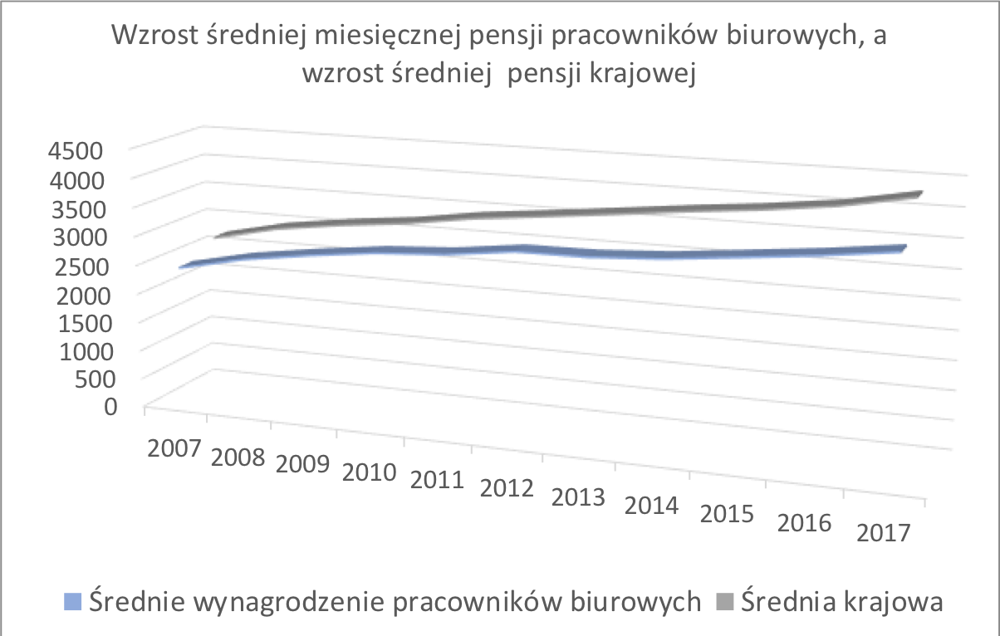
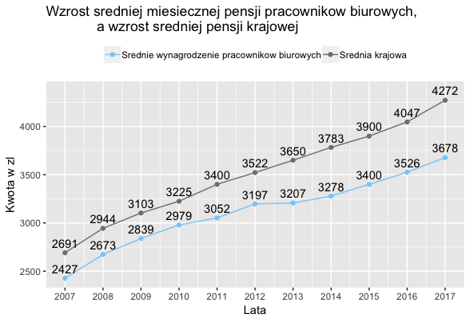

```{r setup, include=FALSE}
knitr::opts_chunk$set(echo = TRUE)
```

## Wstęp - ankieta, wykresy i pytania

Na potrzeby tej pracy przygotowałam [ankietę](https://goo.gl/forms/kFpB9ggO1FzaqQgG2), w której zawarte są 2 wykresy - Wykres 1. (ten wykres 3D został zrobiony w Excel-u) i Wykres 2. (wykres zrobiony przy użyciu biblioteki ggplot2) oraz identyczne zestawy pytań:

1. Ile wynosiła średnia krajowa w 2007 roku?
2. Ile wynosiło średnie wynagrodzenie pracowników biurowych w 2007 roku?
3. Ile wynosiła średnia krajowa w 2017 roku?
4. Ile wynosiło średnie wynagrodzenie pracowników biurowych w 2017 roku?
5. Jaki był przyrost średniej krajowej w latach 2007-2017?
6. Jaki był przyrost średniego wynagrodzenia pracowników biurowych w latach 2007-2017?
7. Jak zwiększyła się różnica między pensją krajową, a pensją pracowników biurowych w latach 2007-2017?

Uwaga! 

Jedynie część danych jest prawdziwa, a brakujące dane zostały wymyślone na potrzeby projektu.

Poniższe zestawienie zostało oparte na pierwszych 15 zgłoszonych odpowiedziach.

```{r echo=FALSE, out.width='80%',fig.cap="Wykres 1. zrobiony w Excel-u"}

```

```{r echo=FALSE, out.width='80%',fig.cap="Wykres 2. zrobiony za pomocq ggplot2"}

```

```{r pack, echo=FALSE, warning=FALSE}
#install.packages("ggplot2")
#install.packages("data.table")
#install.packages("ggthemes")
library(ggplot2)
library(data.table)
library(ggthemes)
```

## Odpowiedzi ankietowanych

1. Ile wynosiła średnia krajowa w 2007 roku?

Prawidlłowa opowiedź to ok. 2500 zł. Na podstawie Wykresu 1. jedynie dwie trzecie ankietowanych odpowiedziało dobrze, a na podstawie Wykresu 2. - ponad 90 %.

```{r plot1, echo=FALSE, fig.width=8, fig.height=4}
gg_color_hue <- function(n) {
  hues = seq(15, 375, length = n + 1)
  hcl(h = hues, l = 65, c = 100)[1:n]
}
palette1 <- gg_color_hue(7)
x <- c(0,66.7,33.3,0,0,0,0)
y <- c(0,93.3,0,0,0,0,6.7)

data1 <- rbind(x,y)
nazwy <- c("Wykres 1.","Wykres 2.")
data1 <- cbind(nazwy,data1)
colnames(data1) <- c("wykres","ok.2000 zl miesiecznie    ","ok.2500 zl miesiecznie    ","ok.3000 zl miesiecznie    ","ok.3500 zl miesiecznie    ","ok.4000 zl miesiecznie    ","ok.4500 zl miesiecznie    ","trudno powiedziec")
ym <- melt(data.table(data1),id="wykres")
ym <- melt(data.table(data1),id="wykres")
ym$value = as.numeric(as.character(ym$value))
ym1 <- ym[wykres=="Wykres 1."]
ym1$cum <- cumsum(ym1$value)
ym2 <- ym[wykres=="Wykres 2."]
ym2$cum <- cumsum(ym2$value)
ym <- rbind(ym1,ym2)
ym <- ym[value!=0]

ggplot(ym,aes(x=wykres, y=-value, fill=variable)) +
  geom_bar(width = 0.8,stat="identity")+
  scale_fill_manual(values=palette1[c(2,3,7)])+ 
  scale_x_discrete(limits = c("Wykres 2.","Wykres 1.")) +
  geom_text(aes(y = cum-100- (value/2),label = paste0(value,"%")))+
  labs(title="Odpowiedzi na 1. pytanie", y="",x="")+
  theme(panel.grid.major = element_blank(),
        panel.grid.minor = element_blank(),
        panel.background = element_blank(),
        axis.text.y = element_text(colour = "black", size = 10),
        title = element_text(size=14),
        axis.ticks.y = element_blank(),
        axis.ticks.x = element_blank(),
        axis.text.x = element_blank(),
        legend.title=element_blank(),legend.position="top")+
  coord_flip()
```

2. Ile wynosiło średnie wynagrodzenie pracowników biurowych w 2007 roku?

Prawidlłowa opowiedź to ok. 2500 zł. Na podstawie Wykresu 1. jedynie 40 % ankietowanych odpowiedziało dobrze. Więcej ankietowanych (53.3 %) wybrało odpowiedź "ok. 2000 zł", z czego wynika, że na pierwszym wykresie trudno jest ocenić wartości przedstawionych danych. 

Na podstawie Wykresu 2. aż około 93 % ankietowanych odpowiedziało dobrze, a pozostali zaznaczyli odpowiedź "Trudno powiedzieć".

```{r plot2, echo=FALSE, fig.width=8, fig.height=4}
x <- c(53.3,40,0,0,0,0,6.7)
y <- c(0,93.3,0,0,0,0,6.7)

data1 <- rbind(x,y)
nazwy <- c("Wykres 1.","Wykres 2.")
data1 <- cbind(nazwy,data1)
colnames(data1) <- c("wykres","ok.2000 zl miesiecznie    ","ok.2500 zl miesiecznie    ","ok.3000 zl miesiecznie    ","ok.3500 zl miesiecznie    ","ok.4000 zl miesiecznie    ","ok.4500 zl miesiecznie    ","trudno powiedziec")
ym <- melt(data.table(data1),id="wykres")
ym <- melt(data.table(data1),id="wykres")
ym$value = as.numeric(as.character(ym$value))
ym1 <- ym[wykres=="Wykres 1."]
ym1$cum <- cumsum(ym1$value)
ym2 <- ym[wykres=="Wykres 2."]
ym2$cum <- cumsum(ym2$value)
ym <- rbind(ym1,ym2)
ym <- ym[value!=0]

ggplot(ym,aes(x=wykres, y=-value, fill=variable)) +
  geom_bar(width = 0.8,stat="identity")+
  scale_fill_manual(values=palette1[c(1,2,7)])+ 
  scale_x_discrete(limits = c("Wykres 2.","Wykres 1.")) +
  geom_text(aes(y = cum-100- (value/2),label = paste0(value,"%")))+
  labs(title="Odpowiedzi na 2. pytanie", y="",x="")+
  theme(panel.grid.major = element_blank(),
        panel.grid.minor = element_blank(),
        panel.background = element_blank(),
        axis.text.y = element_text(colour = "black", size = 10),
        title = element_text(size=14),
        axis.ticks.y = element_blank(),
        axis.ticks.x = element_blank(),
        axis.text.x = element_blank(),
        legend.title=element_blank(),legend.position="top")+
  coord_flip()
```

3. Ile wynosiła średnia krajowa w 2017 roku?

Prawidłowa opowiedź to 4272 zł, co w moim przekonaniu wynosi ok. 4500 zł. Wtedy na podstawie Wykresu 1. jedynie 33.3 % ankietowanych odpowiedziało dobrze, a na podstawie Wykresu 2. - tylko 26.7 %. W obu przypadkach więcej ankietowanych wybrało odpowiedź "ok. 4000 zł" zamiast poprawnej, z czego wynika, że nawet kiedy wartości były wypisane na Wykresie 2., to nadal ankietujący częściej wybierali odpowiedź "ok. 4000 zł". 

Jeżeli założymy, że obie odpowiedzi "ok. 4000 zł" i "ok. 4500 zł" są prawidłowe, to wyniki na postawie obu wykresów można uzać za równie dobre - wtedy dobrze odpowiedziało 80 % ankietowanych.  

```{r plot3, echo=FALSE, fig.width=8, fig.height=4}
x <- c(0,0,0,13.3,46.7,33.3,6.7)
y <- c(0,0,0,13.3,53.3,26.7,6.7)

data1 <- rbind(x,y)
nazwy <- c("Wykres 1.","Wykres 2.")
data1 <- cbind(nazwy,data1)
colnames(data1) <- c("wykres","ok.2000 zl miesiecznie    ","ok.2500 zl miesiecznie    ","ok.3000 zl miesiecznie    ","ok.3500 zl miesiecznie    ","ok.4000 zl miesiecznie    ","ok.4500 zl miesiecznie    ","trudno powiedziec")
ym <- melt(data.table(data1),id="wykres")
ym <- melt(data.table(data1),id="wykres")
ym$value = as.numeric(as.character(ym$value))
ym1 <- ym[wykres=="Wykres 1."]
ym1$cum <- cumsum(ym1$value)
ym2 <- ym[wykres=="Wykres 2."]
ym2$cum <- cumsum(ym2$value)
ym <- rbind(ym1,ym2)
ym <- ym[value!=0]

ggplot(ym,aes(x=wykres, y=-value, fill=variable)) +
  geom_bar(width = 0.8,stat="identity")+
  scale_fill_manual(values=palette1[4:7])+ 
  scale_x_discrete(limits = c("Wykres 2.","Wykres 1.")) +
  geom_text(aes(y = cum-100- (value/2),label = paste0(value,"%")))+
  labs(title="Odpowiedzi na 3. pytanie", y="",x="")+
  theme(panel.grid.major = element_blank(),
        panel.grid.minor = element_blank(),
        panel.background = element_blank(),
        axis.text.y = element_text(colour = "black", size = 10),
        title = element_text(size=14),
        axis.ticks.y = element_blank(),
        axis.ticks.x = element_blank(),
        axis.text.x = element_blank(),
        legend.title=element_blank(),legend.position="top")+
  coord_flip()
```

4. Ile wynosiło średnie wynagrodzenie pracowników biurowych w 2017 roku?

Prawidlłowa opowiedź to ok. 3500 zł. Na podstawie Wykresu 1. 53.3 % ankietowanych odpowiedziało dobrze, a na podstawie Wykresu 2. - 60 %. Na obu wykresach aż jedna trzecia ankietowanych wybrała odpowiedź "ok. 4000 zł" zamiast prawidłowej. 

```{r plot4, echo=FALSE, fig.width=8, fig.height=4}
x <- c(0,0,6.7,53.3,33.3,0,6.7)
y <- c(0,0,0,60,33.3,0,6.7)

data1 <- rbind(x,y)
nazwy <- c("Wykres 1.","Wykres 2.")
data1 <- cbind(nazwy,data1)
colnames(data1) <- c("wykres","ok.2000 zl miesiecznie    ","ok.2500 zl miesiecznie    ","ok.3000 zl miesiecznie    ","ok.3500 zl miesiecznie    ","ok.4000 zl miesiecznie    ","ok.4500 zl miesiecznie    ","trudno powiedziec")
ym <- melt(data.table(data1),id="wykres")
ym <- melt(data.table(data1),id="wykres")
ym$value = as.numeric(as.character(ym$value))
ym1 <- ym[wykres=="Wykres 1."]
ym1$cum <- cumsum(ym1$value)
ym2 <- ym[wykres=="Wykres 2."]
ym2$cum <- cumsum(ym2$value)
ym <- rbind(ym1,ym2)
ym <- ym[value!=0]

ggplot(ym,aes(x=wykres, y=-value, fill=variable)) +
  geom_bar(width = 0.8,stat="identity")+
  scale_fill_manual(values=palette1[c(3,4,5,7)])+ 
  scale_x_discrete(limits = c("Wykres 2.","Wykres 1.")) +
  geom_text(aes(y = cum-100- (value/2),label = paste0(value,"%")))+
  labs(title="Odpowiedzi na 4. pytanie", y="",x="")+
  theme(panel.grid.major = element_blank(),
        panel.grid.minor = element_blank(),
        panel.background = element_blank(),
        axis.text.y = element_text(colour = "black", size = 10),
        title = element_text(size=14),
        axis.ticks.y = element_blank(),
        axis.ticks.x = element_blank(),
        axis.text.x = element_blank(),
        legend.title=element_blank(),legend.position="top")+
  coord_flip()
```

5. Jaki był przyrost średniej krajowej w latach 2007-2017?

Prawidlłowa opowiedź to 60 %. Na podstawie Wykresu 1. 26.7 % ankietowanych odpowiedziało dobrze, a na podstawie Wykresu 2. jedynie 20&nbsp;%.

```{r plot5, echo=FALSE, fig.width=8, fig.height=4}
palette2 <- gg_color_hue(9)
x <- c(0,20,6.7,20,26.7,13.3,6.7,6.7,0)
y <- c(0,0,33.3,13.3,20,20,6.7,0,6.7)

data1 <- rbind(x,y)
nazwy <- c("Wykres 1.","Wykres 2.")
data1 <- cbind(nazwy,data1)
colnames(data1) <- c("wykres","20 %    ","30 %    ","40 %    ","50 %    ","60 %    ","70 %    ","80 %    ","90 %    ","100 %")
ym <- melt(data.table(data1),id="wykres")
ym <- melt(data.table(data1),id="wykres")
ym$value = as.numeric(as.character(ym$value))
ym1 <- ym[wykres=="Wykres 1."]
ym1$cum <- cumsum(ym1$value)
ym2 <- ym[wykres=="Wykres 2."]
ym2$cum <- cumsum(ym2$value)
ym <- rbind(ym1,ym2)
ym <- ym[value!=0]

ggplot(ym,aes(x=wykres, y=-value, fill=variable)) +
  geom_bar(width = 0.8,stat="identity")+
  scale_fill_manual(values=palette2[2:9])+ 
  scale_x_discrete(limits = c("Wykres 2.","Wykres 1.")) +
  geom_text(aes(y = cum-100- (value/2),label = paste0(value,"%")))+
  labs(title="Odpowiedzi na 5. pytanie", y="",x="")+
  theme(panel.grid.major = element_blank(),
        panel.grid.minor = element_blank(),
        panel.background = element_blank(),
        axis.text.y = element_text(colour = "black", size = 10),
        title = element_text(size=14),
        axis.ticks.y = element_blank(),
        axis.ticks.x = element_blank(),
        axis.text.x = element_blank(),
        legend.title=element_blank(),legend.position="top")+
  coord_flip()
```

6. Jaki był przyrost średniego wynagrodzenia pracowników biurowych w latach 2007-2017?

Prawidlłowa opowiedź to 50 %. Na podstawie Wykresu 1. 20 % ankietowanych odpowiedziało dobrze, a na podstawie Wykresu 2. - 26.7 %.

```{r plot6, echo=FALSE, fig.width=8, fig.height=4}
x <- c(6.7,13.3,13.3,20,20,6.7,13.3,0,6.7)
y <- c(0,6.7,20,26.7,20,20,0,6.7,0)

data1 <- rbind(x,y)
nazwy <- c("Wykres 1.","Wykres 2.")
data1 <- cbind(nazwy,data1)
colnames(data1) <- c("wykres","20 %    ","30 %    ","40 %    ","50 %    ","60 %    ","70 %    ","80 %    ","90 %    ","100 %")
ym <- melt(data.table(data1),id="wykres")
ym <- melt(data.table(data1),id="wykres")
ym$value = as.numeric(as.character(ym$value))
ym1 <- ym[wykres=="Wykres 1."]
ym1$cum <- cumsum(ym1$value)
ym2 <- ym[wykres=="Wykres 2."]
ym2$cum <- cumsum(ym2$value)
ym <- rbind(ym1,ym2)
ym <- ym[value!=0]

ggplot(ym,aes(x=wykres, y=-value, fill=variable)) +
  geom_bar(width = 0.8,stat="identity")+
  scale_fill_manual(values=palette2[1:9])+ 
  scale_x_discrete(limits = c("Wykres 2.","Wykres 1.")) +
  geom_text(aes(y = cum-100- (value/2),label = paste0(value,"%")))+
  labs(title="Odpowiedzi na 6. pytanie", y="",x="")+
  theme(panel.grid.major = element_blank(),
        panel.grid.minor = element_blank(),
        panel.background = element_blank(),
        axis.text.y = element_text(colour = "black", size = 10),
        title = element_text(size=14),
        axis.ticks.y = element_blank(),
        axis.ticks.x = element_blank(),
        axis.text.x = element_blank(),
        legend.title=element_blank(),legend.position="top")+
  coord_flip()
```

7. Jak zwiększyła się różnica między pensją krajową, a pensją pracowników biurowych w latach 2007-2017?

Różnica między pensjami w 2017 roku jest ok. 2 razy większa niż w 2007 roku. Na podstawie Wykresu 1. tylko 6.7 % ankietowanych podało tę odpowiedź. Na podstawie Wykresu 2. aż 53.3 % ankietowanych odpowiedziało dobrze.

```{r plot7, echo=FALSE, fig.width=8, fig.height=4}
x <- c(46.7,6.7,6.6,40)
y <- c(26.7,53.3,13.3,6.7)

data1 <- rbind(x,y)
nazwy <- c("Wykres 1.","Wykres 2.")
data1 <- cbind(nazwy,data1)
colnames(data1) <- c("wykres"," 1,5-krotnie", "2-krotnie","3-krotnie","Trudno powiedziec")
ym <- melt(data.table(data1),id="wykres")
ym <- melt(data.table(data1),id="wykres")
ym$value = as.numeric(as.character(ym$value))
ym1 <- ym[wykres=="Wykres 1."]
ym1$cum <- cumsum(ym1$value)
ym2 <- ym[wykres=="Wykres 2."]
ym2$cum <- cumsum(ym2$value)
ym <- rbind(ym1,ym2)
ym <- ym[value!=0]

ggplot(ym,aes(x=wykres, y=-value, fill=variable)) +
  geom_bar(width = 0.8,stat="identity")+
  scale_x_discrete(limits = c("Wykres 2.","Wykres 1.")) +
  geom_text(aes(y = cum-100- (value/2),label = paste0(value,"%")))+
  labs(title="Odpowiedzi na 7. pytanie", y="",x="")+
  theme(panel.grid.major = element_blank(),
        panel.grid.minor = element_blank(),
        panel.background = element_blank(),
        axis.text.y = element_text(colour = "black", size = 10),
        title = element_text(size=14),
        axis.ticks.y = element_blank(),
        axis.ticks.x = element_blank(),
        axis.text.x = element_blank(),
        legend.title=element_blank(),legend.position="top")+
  coord_flip()
```

## Podsumowanie

W pytaniach 1-4, które mają na celu sprawdzić, czy ankietowany jest w stanie odczytać dane z wykresu, zazwyczaj odpowiedzi udzielone na podstawie Wykresu 2. były bardziej trafne, niż te udzielone na podstawie Wykresu 1. Wyjątkiem tu było pytanie 3., w którym ankietowani zaorkąglali 4272 do 4000 zamiast do 4500. Może to wynikać między innymi z tego, że na osi y Wykresu 2. brakuje zaznaczenia, gdzie znajduje się wartość 4500. Być może gdyby jej nie zabrakło ankietowani udzieliliby lepszych odpowiedzi.

W pytaniach 5-6, które polegały na wyciągnięciu wniosków w oparciu o wartości przedstawione na wykresie, odpowiedzi były porównywalne niezależnie od tego, na podstawie którego wykresu zosały udzielone. Nie jest to niczym zaskakującym, ponieważ żeby być w stanie na pierwszy rzut oka dobrze odpowiedzieć na to pytanie, potrzebny byłby wykres słupkowy, w którym oś y obejmowałaby wartości od 0 do 4500 zł.

W pytaniu 7, które polegało na porównaniu różnic widocznych na wykresie, znacznie więcej ankietowanych odpowiedziało dobrze w oparciu o Wykres 2. 

Ogółem odpowiedzi udzielone na podstawie Wykresu 2. były nie tylko bardziej trafne, ale i spójniejsze (tzn. ankietowani zaznaczali mniej różnych odpowiedzi), niż te udzielone na postawie Wykresu 1. Powody, dla których Wykres 2. jest lepszy, to przede wszystkim brak trójwymiarowości i obecność wartości na wykresie, co pokazuje że obecnie nadal mamy problem z odczytywaniem danych ze źle opisanych wykresów trójwymiarowych.


