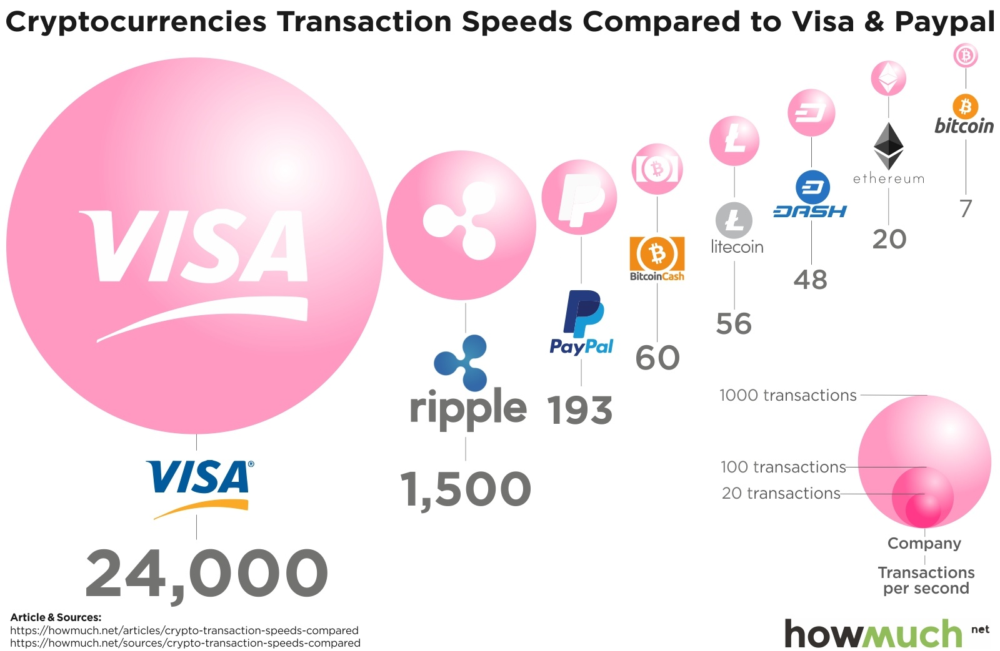
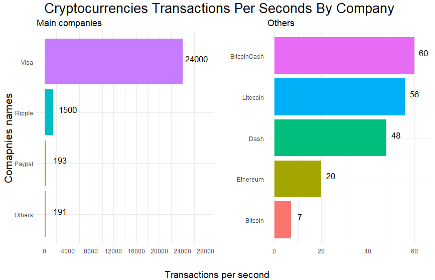
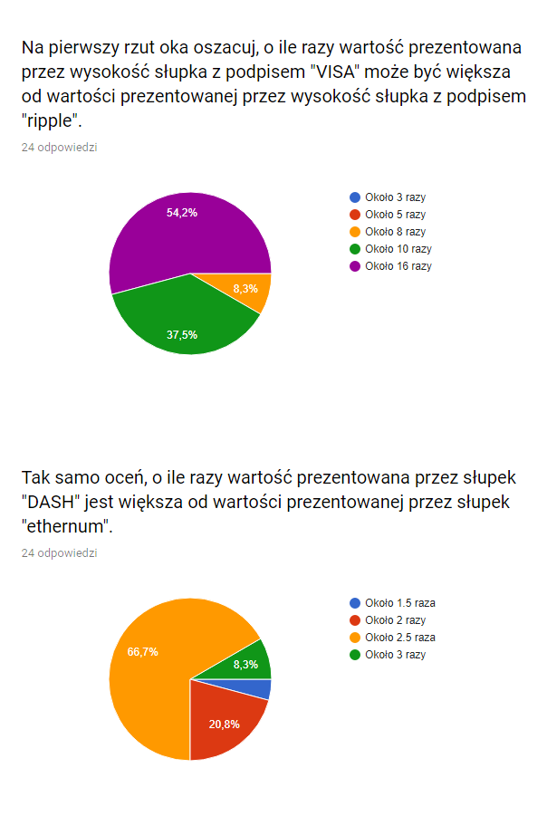

#Wstęp
Celem pracy jest sprawdzenie czy omawiane na wykładzie błędy w prezentowaniu danych, faktycznie wpływają na odbiór przez społeczeństwo, które wykresami karmione jest od urodzenia. Moim celem jest pokazanie jak sposób prezentowania wartości na wykresie może wpłynąć na trudności w porównywaniu ich. Dla przeciętnego człowieka trudne jest już porównywanie wielkości prezentowanych przez powierzchnie, a wykres, który wybrałem w celu pokazania złych praktyk prezentuje je za pomocą objętości (sic).Na potrzeby badania przygotowałem ankietę składającą się z 4 pytań do dwóch rónych wykresów - słupkowego i "bąbelkowego". [Ankieta](https://docs.google.com/forms/d/e/1FAIpQLScSjO5GzskWBnXOwUG2FwMYtPy7K2W5Mrnqi9qYZOR59ShY3Q/viewform?fbclid=IwAR3W8DCixUuDP7Pmmqn356c3Ol9HItfLoZCgPs-noVM5gzgvfWUbSqehM_4)

##Przedstawione wykresy

Żródło pierwszego wykresu: https://www.valuewalk.com/2018/01/transactions-speeds-cryptocurrencies-stack-visa-paypal/?fbclid=IwAR2a1DG1AE2PX8Hri2ZS0-6-lxH49xQBwo-PDhI-I6TYk62ut1dzkbypSaE

   

Na podstawie tych dwóch wykresów i ankiety starałem się przedstawić problem związany z trudnością porównywania wartości przedstawianych na wykresach poprzez objętośc w porównaniu do prostych wykresów słupkowych. Z obu wykresów zostały usunięte podpisy liczbowe, a także wartości ze skali, aby uczestnicy ankiety porównywali wyniki na podstawie wykresów, a nie podanych wartości liczbowych. W momencie sporządzania raportu w ankiecie wzięły udział 24 osoby.

##Analiza

Przed dalszą częśćią raportu sugeruję zapoznać się z ankietą i zawartymi w niej pytaniami, w celu lepszego zrozumienia wyników.
Wyniki dla pierwszego wykresu - "bąbelkowego":

  

Wyniki dla drugiego wykresu - "słupkowego":

 
  
W przypadku wykresu bąbelkowego poprawny wynik w pierwszym pytaniu udzieliło jednynie 4.2% uczestków, w przypadku wykresu słupkowego było to, aż 52,4%, a odpowiedzi były bardzo zbliżone do faktycznego stanu rzeczy. W drugim pytaniu na podstawie wiadomosci z wykresu pierwszego dobrej odpowiedzi udzieliło 16.7% ankietowanych. Ankietowani, którzy wspierali się wykresem słupkowym uzyskali o wiele lepszy wynik - około 70% dobrych odpowiedzi.
  
Wyniki ankiety jednoznacznie wskazały na to, że łatwiej jest porównywać ze sobą wysokości słupków niż objętości "bąbelków".

