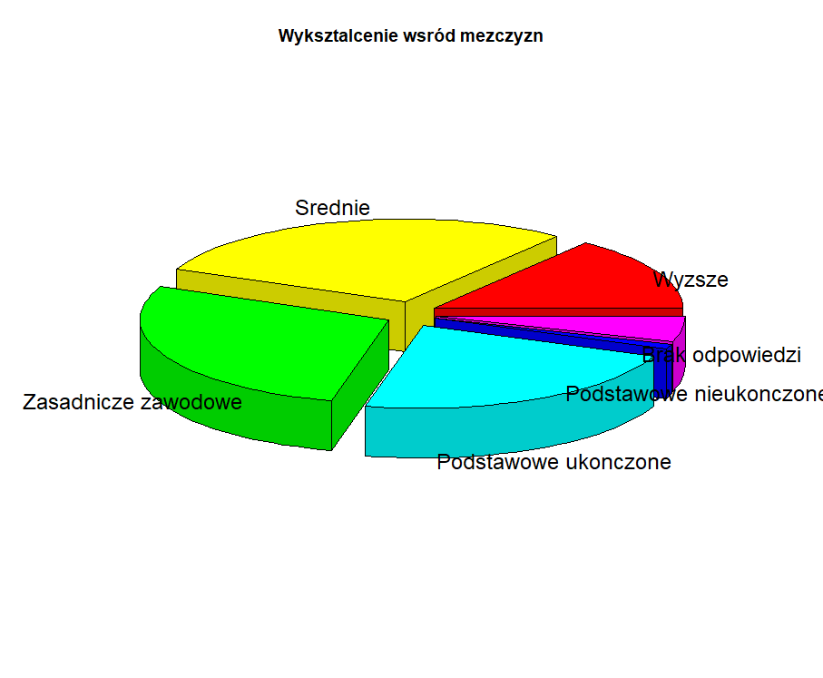
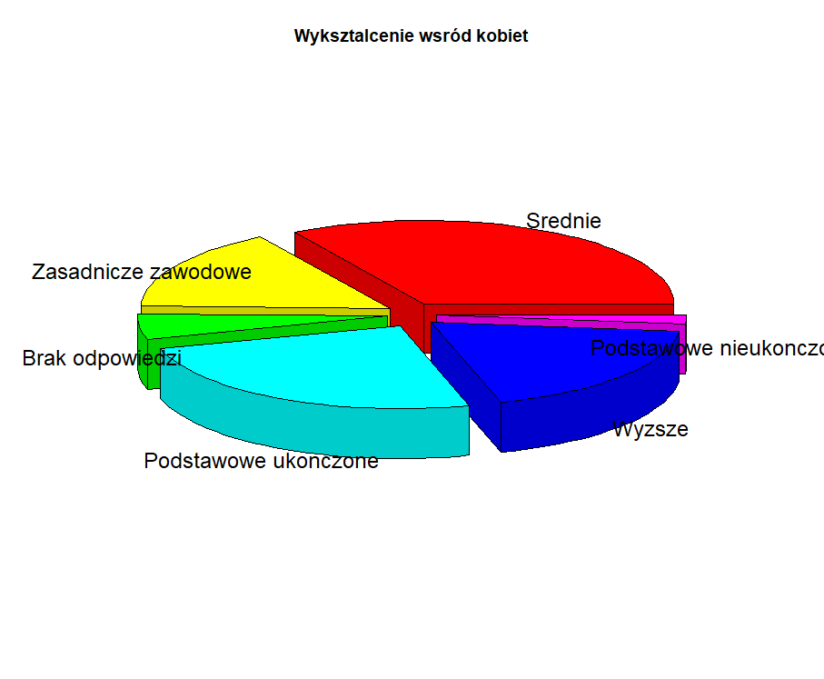

```{R, echo = FALSE, warnings = FALSE, message = FALSE}
library(ggplot2)
library(scales)
library(plotly)
library(plotrix)
library(gridExtra)
```
<center>
<h1>Techniki wizualizacji danych</h1>
<h3>Praca domowa 5</h3>
<h4>Autor: Patryk Wołosz</h4>
</center><br/>
</center>

W ramach tej pracy domowej przeprowadziłem dwa eksperymenty. Polegały one na sprawdzeniu czy niepoprawnie wykonane wykresy wprowadzają odbiorców w błąd - do każdego z wykresów były 3 pytania, na które odpowiadali ankietowani. 25 osób wzięło w ankiecie.

## Eksperyment 1

Podany był wykres widoczny poniżej. Na tym wykresie skala celowo nie zaczyna się od zera oraz dodany został element rozpraszający uwagę - wartość reprezentowana jako kolor.
<center>
```{R, echo = FALSE}
labels <- c('2010','2011','2012','2013','2014','2015','2016','2017','2018','2019')
data <- c(1317,1386,1500,1600,1680,1750,1850,2000,2100,2250)
df <- data.frame('labels' = labels, 'salary' = data)

ggplot(df,aes(x = labels, y = salary, fill = salary)) +
  scale_y_continuous(expand = c(0,0), limits = c(500,2500),oob = rescale_none)+
  geom_bar(stat = 'identity') +
  theme_bw()+
  labs(x = "Lata", y = "Minimalne wynagrodzenie", fill = "Wynagrodzenie") +
  ggtitle("Minimalne wynagrodzenie w Polsce na przestrzeni lat (brutto PLN)") +
  theme(plot.title = element_text(hjust = 0.5))
```
</center>

#### Pytanie 1 - Czy podane zdanie jest prawdziwe: "płaca minimalna zwiększyła się dwukrotnie od 2010 do 2019 roku"?
<center>
```{R, echo = FALSE}
n <- 25
labels_bin <- c("Tak","Nie")
min_2x <- c(8,17)
salary_netto <- c(17,8)

data <- data.frame("first" = min_2x, 
                   "second" = salary_netto,
                   "fourth" = c(18,7),
                   "fifth" = c(16,9),
                   "sixth" = c(15,10))
ggplot(data, aes(x = c("Tak","Nie"), y = first)) +
  geom_bar(stat = "identity", fill = "#6fa1f2") +
  theme_bw() +
  scale_y_continuous(expand = c(0,0), limits = c(0,20)) +
  theme(panel.grid.major.x = element_blank()) +
  labs(x = "Odpowiedź", y = "Ilość odpowiedzi") +
  geom_text(aes(label = scales::percent(first/25)), vjust = -0.5)
```
</center>

#### Pytanie 2 - Czy podane zdanie jest prawdziwe: "płaca minimalna w 2019 roku będzie wynosić około 2250 zł netto"?
<center>
```{R, echo = FALSE}
ggplot(data, aes(x = c("Tak","Nie"), y = second)) +
  geom_bar(stat = "identity", fill = "#6fa1f2") +
  theme_bw() +
  scale_y_continuous(expand = c(0,0), limits = c(0,20)) +
  theme(panel.grid.major.x = element_blank()) +
  labs(x = "Odpowiedź", y = "Ilość odpowiedzi") +
  geom_text(aes(label = scales::percent(second/25)), vjust = -0.5)
```
</center>

#### Pytanie 3 - Pierwsza rzecz, na którą zwróciłeś/aś uwagę to?

<center>
```{R, echo = FALSE}
d1 <- data.frame("labels" = c("Niska płaca w 2010", "Wysoka płaca w 2019","Tytuł","Opis osi","Inne"),
                 values = c(5,1,6,9,4))

ggplot(d1, aes(x = labels, y = values)) +
  geom_bar(stat = "identity", fill = "#6fa1f2") +
  theme_bw() +
  scale_y_continuous(expand = c(0,0), limits = c(0,10)) +
  labs(x = "Odpowiedź", y = "Ilość odpowiedzi") +
  geom_text(aes(label = scales::percent(values/25)), vjust = -0.5) 
```
</center>

W przypadku tego wykresu niewiele osób nie zauważyło, że skala nie zaczyna się od zera (8 osób). Ciekawą obserwacją jest fakt, że aż 17 osób źle odpowiedziało na pytanie o płacę netto w 2019 roku, mimo, że informacja o tym, że są to kwoty brutto była w tytule (wszystkie osoby, które zadeklarowały, że pierwsza rzecz na którą zwróciły uwagę to tytuł źle odpowiedziały na to pytanie). Co do rozposzenia uwagi (pytanie 3) to widać, że ciemniejszy kolor (płaca najniższa) przykuł uwagę większej liczby osób niż jasny kolor dla najwyższej kwoty.

## Eksperyment 2

Widoczne były dwa wykresy podane poniżej, celem było sprawdzenie jak bardzo wykres kołowy 3D może przekłamywać dane.




#### Pytanie 1 - Czy podane zdanie jest prawdziwe: "taki sam procent kobiet i mężczyzn posiada średnie wykształcenie"?

```{R, echo = FALSE}
ggplot(data, aes(x = c("Tak","Nie"), y = fourth)) +
  geom_bar(stat = "identity", fill = "#6fa1f2") +
  theme_bw() +
  scale_y_continuous(expand = c(0,0), limits = c(0,20)) +
  theme(panel.grid.major.x = element_blank()) +
  labs(x = "Odpowiedź", y = "Ilość odpowiedzi") +
  geom_text(aes(label = scales::percent(fourth/25)), vjust = -0.5)

```

#### Pytanie 2 - Czy podane zdanie jest prawdziwe: "1/3 mężczyzn posiada średnie wykształcenie"?

```{R, echo = FALSE}
ggplot(data, aes(x = c("Tak","Nie"), y = fifth)) +
  geom_bar(stat = "identity", fill = "#6fa1f2") +
  theme_bw() +
  scale_y_continuous(expand = c(0,0), limits = c(0,20)) +
  theme(panel.grid.major.x = element_blank()) +
  labs(x = "Odpowiedź", y = "Ilość odpowiedzi") +
  geom_text(aes(label = scales::percent(fifth/25)), vjust = -0.5)
```

#### Pytanie 3 - Czy podane zdanie jest prawdziwe: "25% kobiet posiada wykształcenie podstawowe ukończone"?

```{R, echo = FALSE}
ggplot(data, aes(x = c("Tak","Nie"), y = sixth)) +
  geom_bar(stat = "identity", fill = "#6fa1f2") +
  theme_bw() +
  scale_y_continuous(expand = c(0,0), limits = c(0,20)) +
  theme(panel.grid.major.x = element_blank()) +
  labs(x = "Odpowiedź", y = "Ilość odpowiedzi") +
  geom_text(aes(label = scales::percent(sixth/25)), vjust = -0.5)
```

Właściwe rozkłady prezentują się następująco:

```{R, echo = FALSE}
labels <- c('Wyższe','Średnie','Zasadnicze zawodowe','Podstawowe ukończone','Podstawowe nieukończone', 'Brak odpowiedzi')
m_vals <- c(14.6,28.9,27.8,22.6,1.1,5)
f_vals <- c(18.8,33.7,15.9,25,1.7,4.9)

df <- data.frame('labels'=labels,'men'=m_vals,'women'=f_vals)

p1 <- ggplot(df, aes(x = labels, y = men)) +
  geom_bar(stat = "identity", fill = "#6fa1f2")+
  theme_bw() +
  scale_y_continuous(expand = c(0,0), limits = c(0,40))+
  geom_text(aes(label = scales::percent(men/100)), vjust = 0.5, hjust = -0.5) +
  coord_flip() +
  ggtitle("Meżczyźni") +
  labs(x = "Wykształcenie", y = "Procent populacji") +
  theme(plot.title = element_text(hjust = 0.5))

p2 <- ggplot(df, aes(x = labels, y = women)) +
  geom_bar(stat = "identity", fill = "#6fa1f2") +
  theme_bw() +
  scale_y_continuous(expand = c(0,0), limits = c(0,40))+
  geom_text(aes(label = scales::percent(women/100)), vjust = 0.5, hjust = -0.5) +
  coord_flip() +
  ggtitle("Kobiety")+
  labs(x = "Wykształcenie", y = "Procent populacji") +
  theme(plot.title = element_text(hjust = 0.5))

grid.arrange(p1,p2,nrow = 2)


```

W przypadku pytania 1 tylko 7 na 25 osób pomyliło się w odczytaniu danych z wykresów, w przypadku pytania 2 wyniki nie były już tak dobre. Na pytanie 2 aż 16 osób odpowiedziało niepoprawnie. W przypadku ostatniego pytania 10 osób odpowiedziało niepoprawnie. Odczytywanie danych z wykresów kołowych bez wartości wpisanych na wykresie może być problematyczne, dodatkowe dodanie efektu 3D może to jeszcze bardziej utrudnić, co wydaje mi się zostało dość dobrze przedstawione w tym eksperymencie.