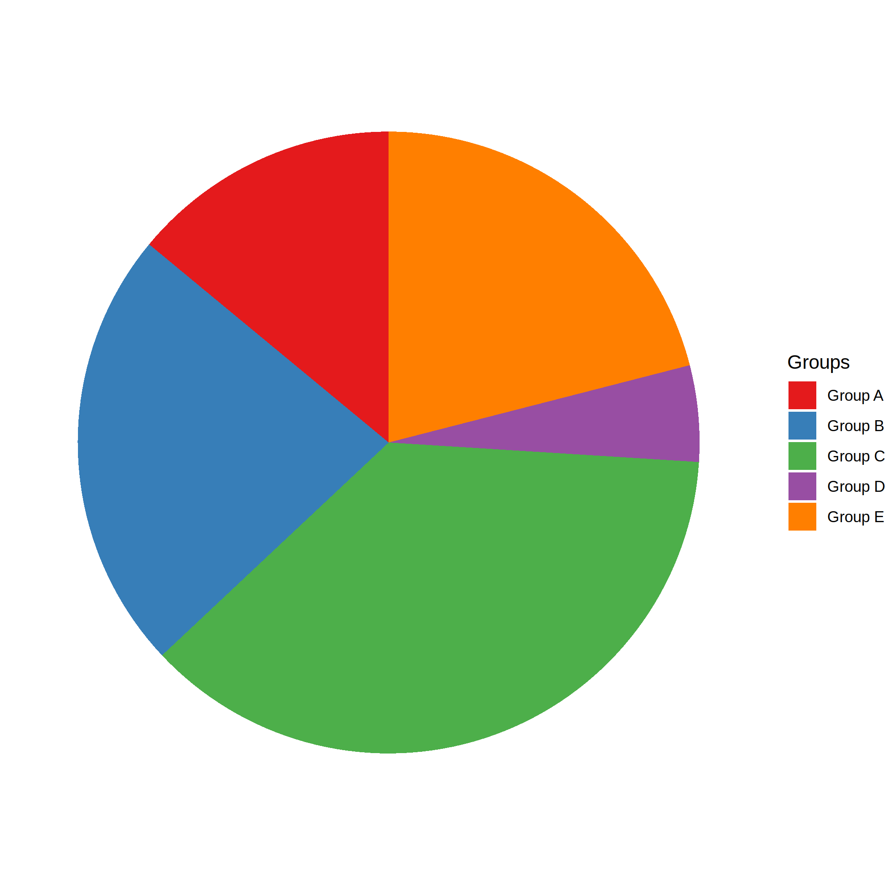
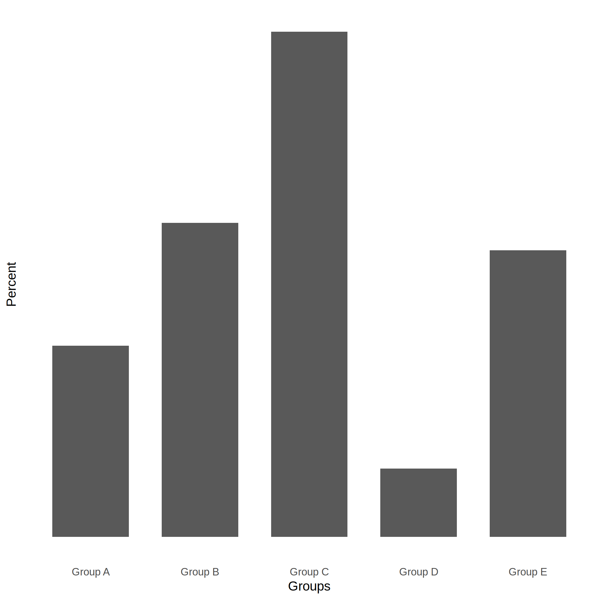

```{r setup, include=FALSE}
knitr::opts_chunk$set(echo = TRUE)
library(ggplot2)
library(reshape2)
library(dplyr)
library(RColorBrewer)
library(patchwork)
```

## Cel
Analiza błędów w odczycie z wykresu kołowego w porównaniu z wykresem słupkowym.

## Realizacja
Ankieta została przeprowadzona na platformie Mechanical Turk. 

Ankietowanym przedstawiono dwa wykresy przedstawiające te same dane: kołowy i słupkowy. Zadano im 3 pytania do każdego wykresu:

  * stwierdzenie, która grupa jest większa dla grup o zbliżonej wielkości (grupy B i E)
  
  * ocenienie wartości dla grup o najwyższej (A) i średniej (C) wielkości na podstawie wartości dla grupy najmniejszej (D)
  
Kopia ankiety znajduje się [tutaj](survey/survey.html).

Eksperyment został zakończony po otrzymaniu 25 odpowiedzi. Dodatkowo zostało odrzuconych 9 odpowiedzi z powodu niezrozumienia treści przez ankietowanych.

Poniższa tabela przedstawia dane użyte w eksperymencie.
```{r data, echo=F}
data <- data.frame(Group=c("Group A", "Group B", "Group C", "Group D", "Group E"), Size=c(14,23,37,5,21))
knitr::kable(data)
```

### Wykresy użyte w eksperymencie
Wykres kołowy             | Wykres słupkowy
:------------------------:|:-----------------------:
 | 

## Wyniki
```{r results, echo=F}
results <- read.csv("./survey/results.csv")
```

### Porównanie grup
```{r comp, echo=F}
comp_result <- results[c("Answer.Graph1LargerGroup", "Answer.Graph2LargerGroup")]
names(comp_result) <- c("Graph1", "Graph2")
melt(comp_result, measure.vars = c("Graph1", "Graph2")) %>% 
  group_by(variable, value) %>% summarise(count = n())  %>%
  ggplot() +
  geom_bar(aes(x=value, y=count, fill=variable), stat="identity", position = "dodge") +
  labs(x="Odpowiedź", y="Liczba odpowiedzi", fill="Rodzaj wykresu") +
  scale_fill_discrete(labels=c("Kołowy", "Słupkowy"))
```

Na wykresie słupkowym większą grupę poprawnie wskazało 23 osoby z 25, podczas gdy na wykresie kołowym 20 osób. 

Spośród 5 osób, które błędnie wskazały grupę na wykresie kołowym, 4 odpowiedziały poprawnie na wykresie słupkowym.
Jedna osoba prawidłowo wskazała grupę na wykresie kołowym, a następnie błędnie na słupkowym.

Różnica między wartościami grup była zaledwie 2%: oczekiwałem większej różnicy między rodzajami wykresów.

### Estymacja wartości z wykresu
```{r estim, echo=F, warning=F, include=F}
estim_result <- subset(results, select=-c(Answer.Graph1LargerGroup, Answer.Graph2LargerGroup))
names(estim_result) <- c("time", "A1", "C1", "A2", "C2")
estim_result$A1diff <- abs(estim_result$A1 - 14)
estim_result$A2diff <- abs(estim_result$A2 - 14)
estim_result$C1diff <- abs(estim_result$C1 - 37)
estim_result$C2diff <- abs(estim_result$C2 - 37)

estim_result %>% select(A1,C1,A2,C2) %>% melt() %>% group_by(variable) %>% summarise("Średnia"=mean(value), "Odchylenie standardowe" = sd(value), "Maks." = max(value), "Min." = min(value)) -> means
means$Grupa <- c("A", "C", "A", "C")
means$Wykres <- c("Kołowy", "Kołowy", "Słupkowy", "Słupkowy")
means[["Prawdziwa wartość"]] <- c(14,37,14,37)
means <- subset(means, select=-variable)
means <- means[c(5,6,7,1,2,3,4)]
```
#### Estymacja największej grupy
Poniższa tabela przedstawia wyniki dla największej grupy. 
```{r, echo=F}
knitr::kable(means[means$Grupa == "C", -1])
```

Ankietowani średnio odpowiedzieli lepiej w przypadku wykresu słupkowego. Dodatkowo ich odpowiedzi były mniej rozrzucone.

##### Zależność błędu absolutnego odpowiedzi od czasu odpowiedzi
```{r, echo=F}
Cmax <- max(estim_result$C1diff, estim_result$C2diff)
Cmin <- min(estim_result$C1diff, estim_result$C2diff)
Climits <- c(Cmin, Cmax)

p1 <- ggplot(estim_result) +
  geom_point(aes(x=C1diff, y=time)) +
  geom_smooth(aes(x=C1diff, y=time), method='lm',formula=y~x) +
  scale_x_continuous(limits = Climits) + 
  labs(x="Błąd odczytu", y="Czas odpowiedzi") +
  ggtitle("Wykres kołowy")
p2 <- ggplot(estim_result) +
  geom_point(aes(x=C2diff, y=time)) +
  geom_smooth(aes(x=C2diff, y=time), method='lm',formula=y~x) +
  scale_x_continuous(limits = Climits) + 
  labs(x="Błąd odczytu", y="Czas odpowiedzi") +
  ggtitle("Wykres słupkowy")
  
p1 + p2
```

Im dłuższy czas odpowiedzi, tym bardziej poprawne były odpowiedzi ankietowanych.

##### Rozkład błędów absolutnych odpowiedzi
```{r, echo=F}
Cbreaks <- seq(Cmin, Cmax, 1)

p1 <- ggplot(estim_result) +
  geom_histogram(aes(x=C1diff), breaks=Cbreaks) +
  labs(x="Błąd odczytu", y="") +
  ylim(0,6) + 
  ggtitle("Wykres kołowy")
p2 <- ggplot(estim_result) +
  geom_histogram(aes(x=C2diff), breaks=Cbreaks) +
  labs(x="Błąd odczytu", y="") +
  ylim(0,6) + 
  ggtitle("Wykres słupkowy")

p1 + p2
```

#### Estymacja średniej grupy
Poniższa tabela przedstawia wyniki dla estymacji średniej grupy. 
```{r, echo=F}
knitr::kable(means[means$Grupa == "A", -1])
```

W tym przypadku sytuacja się odwróciła: ankietowani średnio lepiej odczytali wartość z wykresu kołowego. 
Wartość średnia odpowiedzi dla wykresu kołowego jest zadziwiająco bliska prawdziwej.

##### Zależność błędu absolutnego odpowiedzi od czasu odpowiedzi
```{r, echo=F}
Amax <- max(estim_result$A1diff, estim_result$A2diff)
Amin <- min(estim_result$A1diff, estim_result$A2diff)
Alimits <- c(Amin, Amax)

p1 <- ggplot(estim_result) +
  geom_point(aes(x=A1diff, y=time)) +
  geom_smooth(aes(x=A1diff, y=time), method='lm',formula=y~x) +
  scale_x_continuous(limits = Alimits) + 
  labs(x="Błąd odczytu", y="Czas odpowiedzi") +
  ggtitle("Wykres kołowy")
p2 <- ggplot(estim_result) +
  geom_point(aes(x=A2diff, y=time)) +
  geom_smooth(aes(x=A2diff, y=time), method='lm',formula=y~x) +
  scale_x_continuous(limits = Alimits) + 
  labs(x="Błąd odczytu", y="Czas odpowiedzi") +
  ggtitle("Wykres słupkowy")
  
p1 + p2
```


##### Rozkład błędów absolutnych odpowiedzi
```{r, echo=F}
Abreaks <- seq(Amin, Amax, 1)

p1 <- ggplot(estim_result) +
  geom_histogram(aes(x=A1diff), breaks=Abreaks) +
  labs(x="Błąd odczytu", y="") +
  ylim(0,13) +
  ggtitle("Wykres kołowy")
p2 <- ggplot(estim_result) +
  geom_histogram(aes(x=A2diff), breaks=Abreaks) +
  labs(x="Błąd odczytu", y="") +
  ylim(0,13) +
  ggtitle("Wykres słupkowy")

p1 + p2
```

## Wnioski
Wykres słupkowy sprawdził się lepiej w 2 z 3 pytań. 

Mimo to, różnice między wykresami okazały się niewielkie, a większy wpływ na poprawność odpowiedzi miał czas.

Jednakże, te wyniki należy brać z przymrużeniem oka. Próba była mała, pochodziła z populacji, która się na co dzień zajmuje annotacją danych.
Nie została też postawiona prawidłowa hipoteza badawcza.
