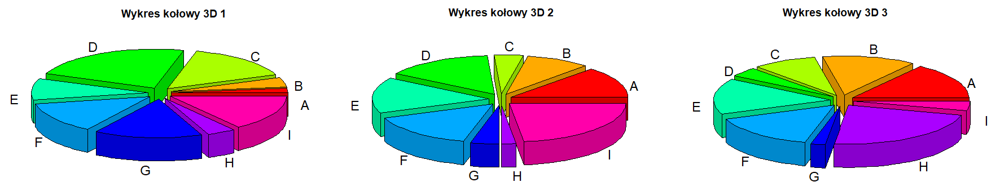
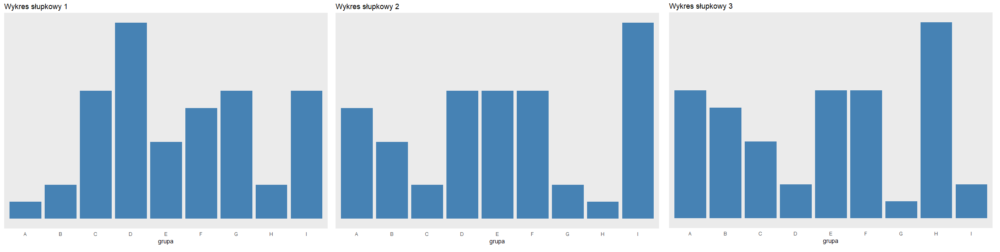

```{r setup, include=FALSE}
knitr::opts_chunk$set(echo = TRUE)
```

## Cel

Celem tej pracy domowej by³o sprawdzenie, czy w spo³eczeñstwie wci¹¿ wystêpuj¹ problemy z czytaniem wykresów. Zdecydowano siê sprawdziæ, czy wykresy ko³owe 3D, naprawdê powoduj¹ a¿ tyle problemów z odczytywaniem danych. 

## Opis ankiety

W celu sprawdzenia powy¿szej tezy, sporz¹dzono anietê, na której poproszono ankieterów (niezwi¹zanych ze œwiatkiem wizualizacji danych), w której przetestowano postrzeganie tych samych zbiorów danych na wykresach ko³owych oraz s³upkowych. Na potrzeby ankiety stworzono jeden zbiór danych, zawieraj¹cy grupy od A do I, którym przyporz¹dkowano wartoœci procentowe, sumuj¹ce siê do 100. Nastêpnie stworzono 3 wersje tego samego zbioru danych, jednak z przepermutowanymi wartoœciami dla niektórych, lub wszystkich grup. Mia³o to na celu sprawdzenie, czy po³o¿enie danego fragmentu "pie-charta" ma znaczenie przy postrzeganiu jego wartoœci. Wersje wykresów ko³owych i s³upkowych odpowiada³y sobie, tzn. prezentowa³y zbiór danych przepermutowny w ten sam sposób. Poni¿ej pokazno kolejno zbiór 3 wykresów ko³owych i s³upkowych.




Link do ankiety: https://docs.google.com/forms/d/e/1FAIpQLSccZLiCT-YDiOtZ469EevBQ30u03Xd82cfaEWR-TsYYFHW7NA/viewform?fbclid=IwAR23726tSnvlZ33ex72694izKsQgZ598P6xSm05wAE0ry6D9ELze0ZU1hlI

## Wyniki ankiety i podsumowanie

W ankiecie wiê³o udzia³ 15 osób, które nie uczêszcza³y na wyk³ad z wizualizacji danych, wiêc nie s¹ œwiadome zagro¿eñ w percepcji postrzegania wykresów ko³owych.

Dla pierwszej permutacji zbioru danych:

- wykres ko³owy: 14 z³ych odpowiedzi, 1 dobra
- wykres s³upkowy: 3 z³e odpwiedzi, 11 dobrych, 1 niewa¿na

Dla drugiej permutacji zbiorów danych:

- wykres ko³owy: 15 z³ych odpowiedzi, 0 dobrych
- wykres s³upkowy: 5 z³ych odpwiedzi, 10 dobrych

Dla trzeciej permutacji zbioru danych:

- wykres ko³owy: 15 z³ych odpowiedzi, 0 dobrych
- wykres s³upkowy: 2 z³e odpwiedzi, 11 dobrych, 2 niewa¿ne

Podsumowuj¹c ankieterzy czêœciej mylili siê uk³adaj¹c kolejnoœæ grup odczytywan¹ z wykresów ko³owych. B³êdy polega³y zarówno na przyrównywaniu grup o ró¿nych wartoœciach liczbowych, jak i zamianach kolejnoœci tych mniejszych z wiekszymi. Najlepiej wypad³a permutacja 1, gdzie jednemu z akieterów uda³o siê odgadn¹æ poprawn¹ odpowiedŸ. Dla wykresów s³upkowych przewa¿a³y odpowiedzi poprawne, aczkolwiek, dla drugiej permutacji udzielono a¿ 5 z³ych odpowiedzi. Mog³o to byæ spowodowane monotonnoœci¹ ankiety i znu¿eniem ankieterów na jej ostatnich etapach, co znalaz³o odbicie, równie¿ w udzielaniu odpowiedzi niewa¿nych (wpisywanie tych smaych grup kilkukrotnie lub ich pomijanie).

Generalnie, z analizy wyników przeprowadzonej ankiety mo¿na wysnuæ wnioski, ¿e wykresy ko³owe, zw³aszcza w 3D, zas³u¿enie s¹ owiane z³¹ s³aw¹.