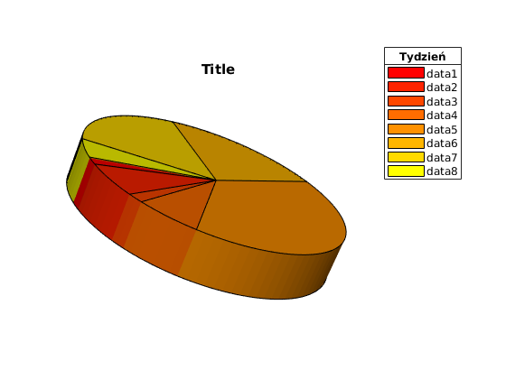
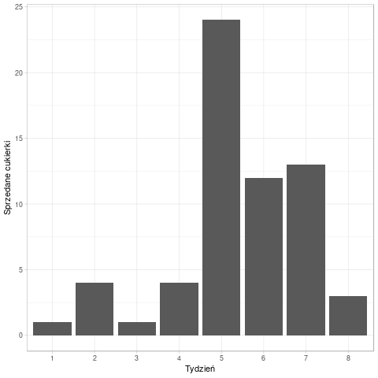

```{r setup, include=FALSE}
knitr::opts_chunk$set(echo = TRUE)
```

## Przeprowadzony eksperyment
Przeprowadzony został następujący eksperyment przy pomocy [formularzy googla](https://goo.gl/forms/8gyFRLWfUkU1rrw13).

Najpierw uczestnikom przedstawiona została informacja:

> Formularz jest pracą domową na przedmiot Techniki Wizualizacji danych. 

> W kolejnych sekcjach zostaniesz zapytany o odpowiedzi na 2x4 pytania, w sumie 8. Pytania są proste :)

> W odpowiedzi  proszę napisać tylko jedną liczbę, w formacie dziesiętnym np. 3.14 albo 0.314.

Następnie został pokazany poniższy wykres:



Oraz zostali oni zapytani ,,Jaki jest stosunek sprzedanych cukierków w [...]?''

1. tygodniu 1 do tygodnia 5
2. tygodniu 5 do tygodnia 6
3. tygodniu 6 do tygodnia 7
4. tygodniu 2 do tygodnia 4

Po odpowiedzeniu na te pytania, uczestnikom przedstawiony został kolejny wykres:



I zostali oni zapytani o te same pytania.

## Cel eksperymentu

Celem eksperymentu było dowiedzenie się ile informacji uczestnicy są w stanie wynieść z wykresu 1 oraz sprawdzenie jak uczestnicy poradzą sobie z interpretacją pytań.

## Rezultaty

Eksperyment przeprowadzono na 28 osobach.

### Poprawność liczbowa odpowiedzi
```{r, echo=FALSE}
data <- read.table('data.tsv')
library(ggplot2)
y <- c(1,4,1,4,24,12,13,3)
```
Na czerwono zostały przedstawione wyniki uzyskane dla pierwszego wykresu. Na niebiesko dla drugiego wykresu. Pionową, czarną prostą zaznaczono wartość poprawną.

```{r, warning=FALSE,message=FALSE,error=FALSE, echo=FALSE}
ggplot(data) +
  geom_histogram(aes(V1), fill = "firebrick1", alpha = 0.5) +
  geom_histogram(aes(V5), fill = "royalblue", alpha = 0.5) +
  xlab("Jaki jest stosunek sprzedanych cukierków w tygodniu 1 do tygodnia 5?") +
  ylab("Zliczenia") +
  geom_vline(xintercept = y[1]/y[5]) +
  theme_minimal()

ggplot(data) +
  geom_histogram(aes(V2), fill = "firebrick1", alpha = 0.5) +
  geom_histogram(aes(V6), fill = "royalblue", alpha = 0.5) +
  xlab("Jaki jest stosunek sprzedanych cukierków w tygodniu 5 do tygodnia 6?") +
  ylab("Zliczenia") +
  geom_vline(xintercept = y[5]/y[6])+
  theme_minimal()

ggplot(data) +
  geom_histogram(aes(V3), fill = "firebrick1", alpha = 0.5) +
  geom_histogram(aes(V7), fill = "royalblue", alpha = 0.5) +
  xlab("Jaki jest stosunek sprzedanych cukierków w tygodniu 6 do tygodnia 7?") +
  ylab("Zliczenia") +
  geom_vline(xintercept = y[6]/y[7])+
  theme_minimal()

ggplot(data) +
  geom_histogram(aes(V4), fill = "firebrick1", alpha = 0.5) +
  geom_histogram(aes(V8), fill = "royalblue", alpha = 0.5) +
  xlab("Jaki jest stosunek sprzedanych cukierków w tygodniu 2 do tygodnia 4?") +
  ylab("Zliczenia") +
  geom_vline(xintercept = y[2]/y[4]) +
  theme_minimal()
```

### Poprawność językowa odpowiedzi

Wiele osób udzieliło odpowiedzi w formacie innym niż zostało sprecyzowane we wstępie:

```{r, warning=FALSE,message=FALSE,error=FALSE, echo=FALSE}
#x = as.factor(c("Poprawny format", "Przecinek zamiast kropki", "Format a:b lub a/b"))

df <- data.frame(y = c(153, 21, 50), x = as.factor(c("Poprawny format", "Przecinek zamiast kropki", "Format a:b lub a/b")))
ggplot(df, aes( x = reorder(x, -y),y, label = y)) +
  geom_col() +
  geom_label(nudge_y = 1) +
  xlab("Typ odpowiedzi") +
  ylab("Ilość odpowiedzi") +
  theme_minimal()

```

### Wnioski

1. Tak jak się spodziewano, wykresy kołowe 3d zakłamują prezentację danych, co w szczególności widać dla pytania nr 2.
2. W odpowiedziach na pytania nr 1 widać, że niektórzy policzyli stosunek odwrotny.
3. Ostatni wykres pokazuje jak wiele osób wpisało odpowiedź w formacie innym niż oczekiwano. Traktując przypadki z przecinkami jako poprawne, ponad 22\% odpowiedzi została udzielona w formacie a:b lub a/b.