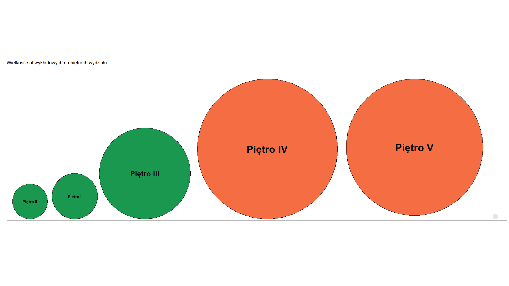
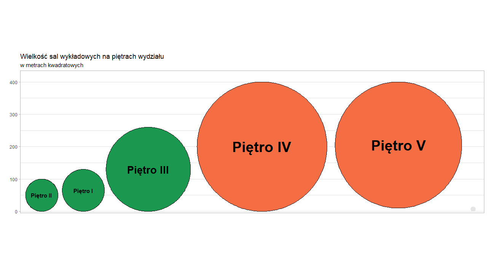

```{r setup, include=FALSE}
knitr::opts_chunk$set(echo = TRUE)
```

W tej pracy domowej stworzyłem eksperyment, który traktuje o nieprawidłowości wykresów. Mimo że założeniem był jeden eksperyment, to postarałem się podzielić go na kilka kategorii, tak, aby zahaczyć o kilka niepoprawnosci tworzenia wizualzacji danych.  
Swój eksperyment podzieliłem na dwie części. Pierwsza, bardziej manipulacyjna, przedstawiała wykres ukazujący łączną powierzchnię sal wykładowych na pewnym wydziale. Niedogodność była taka, że dane pokazałem przy użyciu kół oraz nie narzuciłem jednostek na oś. Stąd domyślnie ankieterzy traktowali wielkość kół jako powierzchnię danych sal, a autorowi chodziło o ... ich średnicę :)  
Ponadto, zbadałem skupienie ankieterów na dane obiekty dodając kolory do wykresu, jedno niepodpisane piętro i zmieniając kolejność w oznaczeniach. Pierwszy wykres wyglądał następująco:


Pierwsze pytania, które postawiłem to:  
1. Czy pierwszy rzut oka był w kierunku pięter 4. oraz 5.?  
2. Czy zauważyłeś/aś niepodpisaną małą kanciapę na 6. piętrze?  
3. Czy zauważyłeś/aś, że piętra niższe nie są przedstawione w kolejności 1 - 2 - 3?  

Spodziewałem się jakie będą wyniki, ale nie byłem ich do końca pewien. Otóż większość osób od razu spojrzała na piętra 4. oraz 5., jednak mimo tego nie zauważyła niepodpisanej małej sali na 6. piętrze. Ponadto, ponad połowa osób nie zwróciła uwagi na kolejność niższych pięter. Warto tutaj podkreślić, że starałem się przepytać ludzi z różnych środowisk. Do tego dodam, że nieschematycznych odpowiedzi głównie udzielili mi studenci MiNI oraz osoby, które mają z myśleniem analitycznym do czynienia na co dzień.

<center>
```{r echo = FALSE}
library(data.table)
library(ggplot2)

t <- as.data.table(read.csv('wyniki_ankiety1.csv', sep = ';', encoding = 'UTF-8'))
result <- data.table(cbind(
  rep(c("Nie", "Tak"), times = 3),
  c(4, 11, 11, 4, 8, 7),
  c(1, 1, 2, 2, 3, 3)
))

colnames(result) <- c("Odpowiedz","Liczba_odp", "Pytanie")
colors = c("red", "green")

ggplot(data = result, aes(x = Pytanie, y = as.numeric(Liczba_odp))) +
  geom_col(aes(fill = Odpowiedz), position = "dodge") +
  scale_y_continuous(limits = c(0, 12), breaks = seq(0, 12, by = 2), expand = c(0.01, 0.05)) +
  scale_x_discrete(labels = c("Pierwszy rzut oka w \n kierunku pięter 4-5?", "Zauważona kanciapa \n na 6. piętrze?", 
                              "Zauważona \n nieprawidłowa \n kolejność pięter 1-3?"), expand = c(0.175, 0.175)) +
  theme_bw() +
  theme(axis.text.x = element_text(size = 13),
        axis.title.y = element_text(size = 13),
        plot.title = element_text(size = 16)) +
  labs(title = "Analiza odpowiedzi na pytania 1-3", x = "", y = "Liczba odpowiedzi") +
  guides(fill = guide_legend(title = "Odpowiedź"))
```
</center>

Dalej zadawałem jeszcze dwa pytania. Najpierw przy wykresie powyższym, a następnie po dodaniu osi. Pytania zadane to:  
1. Co według Ciebie świadczy o tym, że sale wykładowe na piętrach 4. oraz 5. mają łącznie tę samą wielkość i są większe od sal na innych piętrach?  
2. Ile razy bardziej sale na piętrze 2. są mniejsze od sal na piętrze 4.?  

<center>

</center>

Pierwsze pytanie miało w sobie trochę pułapki zakładając, że piętra 4. oraz 5. mają taką samą powierzchnię sal wykładowych, jednak mimo tego nieschematyczne osoby ponownie nie zawiodły. Większość z nich przy pierwszym wykresie zauważyła fakt, że wielkości się różnią, a wykres 5. piętra nie zaczyna się od 0.  
Mimo dodania osi było mało *nawróceń* wśród osób niemyślących często analitycznie. Warto dodać, że więcej zmian zdania było wśród ankieterów, którzy wymienili tylko wielkość jako czynnik wyróżniający piętra 4. oraz 5.
    
    
Drugie pytanie było od razu skazane na porażkę. Bez osi (bądź z nieprawidłowo ustawioną), co często się zdarza w publicznych wizualizacjach, czytelnik nie jest w stanie *przewidzieć* poprawnej odpowiedzi. Po dodaniu osi wszyscy oczywiście wskazywali dobrze. Wyniki pytań poniżej:

<center>
```{r echo=FALSE}
result1 <- data.table(cbind(
  c("Kolor i wielkość", "Wielkość", "Nie są tej samej \n wielkości", 
    "Kolor i wielkość", "Wielkość", "Nie są tej samej \n wielkości"),
  c(4, 7, 3, 3, 4, 7),
  c(1, 1, 1, 2, 2, 2)
))
colnames(result1) <- c("Odpowiedz", "Liczba_odp", "Przedpo")
ggplot(data = result1, aes(x = Przedpo, y = as.numeric(Liczba_odp))) +
  geom_col(aes(fill = Odpowiedz), position = "dodge") +
  scale_y_continuous(limits = c(0, 8), breaks = seq(0, 8, by = 2), expand = c(0.01, 0.05)) +
  scale_x_discrete(labels = c("Bez osi", "Z osią"), expand = c(0.25, 0.25)) +
  theme_bw() +
  theme(axis.text.x = element_text(size = 13),
        axis.title.y = element_text(size = 13),
        plot.title = element_text(size = 16)) +
  labs(title = "Analiza odpowiedzi na pytanie 4", x = "", y = "Liczba odpowiedzi") +
  guides(fill = guide_legend(title = "Odpowiedź"))
```
</center>

<center>
```{r echo=FALSE}
result2 <- data.table(cbind(
  c(6, 8, 9, 10, 13), 
  c(4, 5, 2, 3, 1)
))
colnames(result2) <- c("Odpowiedz", "Liczba_odp")

ggplot(data = result2, aes(x = as.character(Odpowiedz), y = as.numeric(Liczba_odp))) +
  geom_col(fill = "navyblue", position = "dodge") +
  scale_y_continuous(limits = c(0, 7), breaks = seq(0, 8, by = 2), expand = c(0.01, 0.05)) +
  scale_x_discrete(labels = result2$Odpowiedz, expand = c(0.1, 0.1)) +
  theme_bw() +
  theme(axis.text.x = element_text(size = 13),
        axis.title.y = element_text(size = 13),
        plot.title = element_text(size = 16)) +
  labs(title = "Analiza odpowiedzi na pytanie 5", subtitle = "przed dodaniem osi", 
       x = "", y = "Liczba odpowiedzi") +
  guides(fill = guide_legend(title = "Odpowiedź"))
```
</center>

Podsumowując, najważniejszym czynnikiem, który chciałem zbadać, to niepoprawne użycie kół do danego wykresu - udało się. Osoby nie były w stanie przewidzieć wielkości sal wykładowych na piętrach.  
Ponadto, powyżej opisany eksperyment ukazał jak można manipulować okiem ogladającego wykres. Mimo dodania pewnych danych dalej można być w stanie niektóre rzeczy zakamuflować. Tutaj problem i wykres były banalne, jednak przy ważniejszych sprawach taka manipulacja może okazać się kluczowa..