# 1. Wprowadzenie

W celu wykonania zadania, przeprowadziłem ankietę składającą się z dziesięciu pytań do trzech wykresów.

\newline

Poniższa praca zawiera prezentacje różnicy w percepcji odbierania danych z dwóch różnych wykresów, należy pamiętać, że wykresy prezentują to samo, ale na dwa różne sposoby. Najpierw umieszczę różne wykresy, aby czytelnik sam mógł je porównać, a następnie wyniki z ankiet i podsumowanie. Udało mi się otrzymać odpowiedzi od dwudziestu ankieterów.

# 2. Wizualizacja danych

# 2.1. WykresA

# 2.2. WykresB1
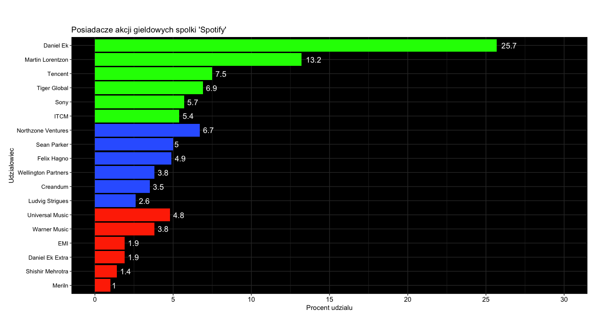

# 2.3. WykresB2
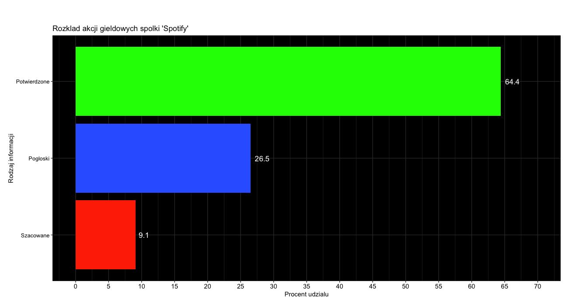

# 3. Wyniki badań

W tym paragrafie zrobię porównanie odpowiedzi na każde pytanie na wykresach słupkowych, na wykresie będzie zaznaczona poprawna odpowiedź i jaki procent ludzi jak odpowiedział.

# 3.1. Na pierwszy rzut oka jaki jest stosunek udziałów Daniel'a Ek'a do udziałów Universal Music?

# 3.1.1 Odpowiedzi na podstawie wykresu A
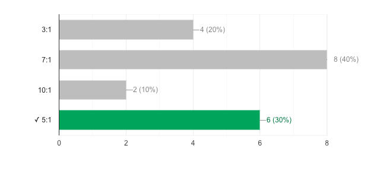

# 3.1.2 Odpowiedzi na podstawie wykresu B1 i B2
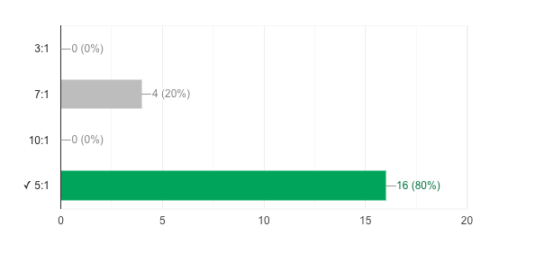

# 3.2. Na pierwszy rzut oka ile procent udziałów jest zadeklarowanych (czerwony kolor na pierwszym i zielony na drugim)?

# 3.2.1 Odpowiedzi na podstawie wykresu A
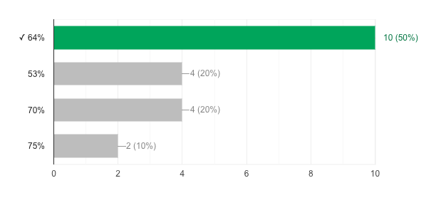

# 3.2.2 Odpowiedzi na podstawie wykresu B1 i B2
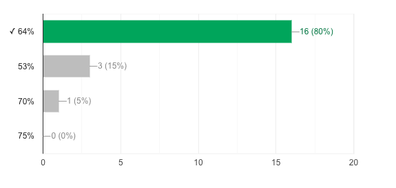

# 3.3. Kto ma więcej udziałów?

# 3.3.1 Odpowiedzi na podstawie wykresu A
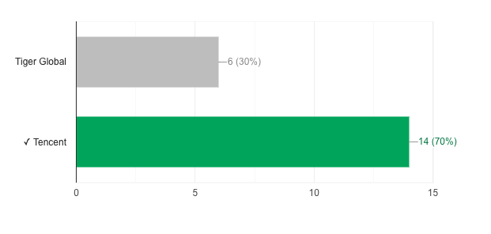

# 3.3.2 Odpowiedzi na podstawie wykresu B1 i B2

# 3.4 Kto ma więcej udziałów?

# 3.4.1 Odpowiedzi na podstawie wykresu A
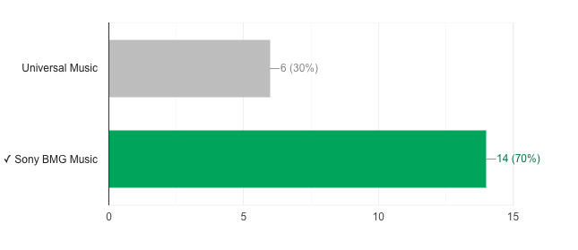

# 3.4.2 Odpowiedzi na podstawie wykresu B1 i B2
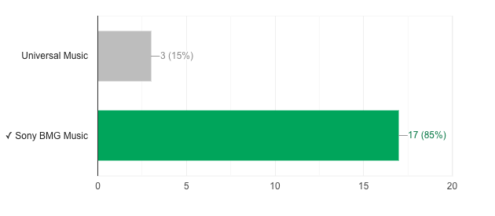

# 3.5. Czy Martin Lorentzon razem z Tiger Global i Ludvig'iem Strigues'em mają więcej udziałów od Daniel'a Ek'a?

# 3.5.1 Odpowiedzi na podstawie wykresu A
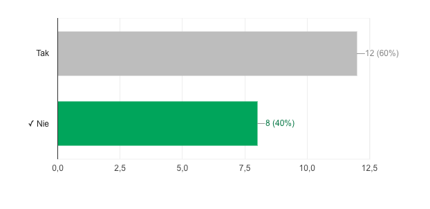

# 3.5.2 Odpowiedzi na podstawie wykresu B1 i B2
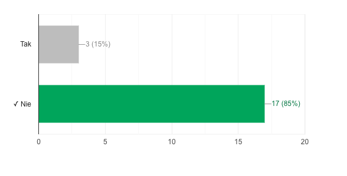

# 4. Podsumowanie

W tej sekcjij chciałbym pokrótce omówić każde i porównań i stwierdzić co można na podstawie różnic między nimi wywnioskować.

\newline

Różnica w odpowiedziach na pierwsze pytanie jest znacząco inna, jeżeli czerpiemy wiedzę z różnych wykresów. Jest tak, ponieważ w tym pytaniu porównujemy wartości niedość, że znacząco różne to jeszcze na wykresie A, nie są one obok siebie co sprawia, że trudniej nam ocenić ich zależność. Natomiast na drugim wykresie niedość, że można porównać dłuości słupków, to jeszcze wartości są podpisane, zatem nie ma pola do popisu.

\newline

Na drugie pytanie na podstawie wykresu A odpowiedziało poprawnie tylko 50% ankietowanych, natomiast na podstawie wykresu B2, aż 80%, co i tak jest dziwne, bo wartość ta jest tam napisana(wynika to prawdopodbnie z losowości, niektórych odpowiedzi). Trudność w wykresie A polega na tym, że ciężko jest na oko określić różnicę między 60%, a 50% zatem bez dokładnych danych ciężko odpowiedzieć poprawnie.

\newline

Odpowiedzi na trzecie pytanie są zbliżone, wręcz takie same. Pytanie zostało umieszone w ankiecie specjalnie, aby ocenić zdolność porównywania wartości przybliżonych oraz położonych blisko siebie na wykresie A.

\newline

Odpowiedzi znowu zbliżone, natomiast widać, że z wykresu B1 już znacznie odczytać poprawny stosunek. Pytanie to jest w lekkie opozcji do pytania 3, ponieważ wartości dalej są zbliżone, ale na wykresie A nie są obok siebie, a zatem ciężej jest je porównać, co widać po odpowiedziach.

\newline

W tej sekcji odpowiedzi się najbardziej różnią, jest to najtrudniejsze pytanie do odpowiedzenia na podstawie wykresu A, ponieważ niedość, że wymaga porównywania odległych wartości to trzeba je jeszcze sumować. Wykres B1 ułatwia to znacznie, bo wystarcza dodawać wartości obok słupków.

\newline

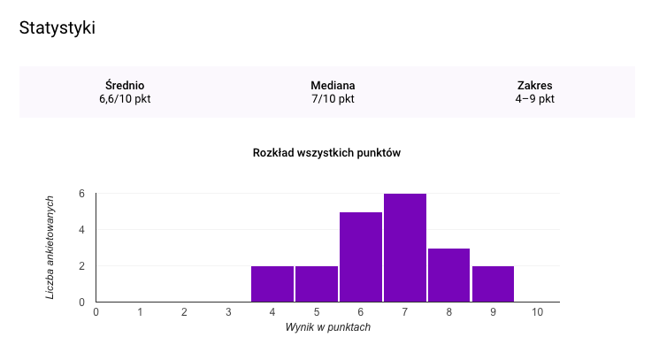

Powyżej są jeszcze dodatkowo przedstawione zdobyte punkty dla każdej ankiety. Każde zadanie było warte jeden punkt, nad wykresem wypisane są takie wartości jak średnia arytmetyczna, mediana i zakres zdobytych punktów. Widać, ze nikt nie odpowiedział poprawnie na wszytkie pytania, ale również wszyscy odpowiedzieli poprawnie na conajmniej 3 z 10.

