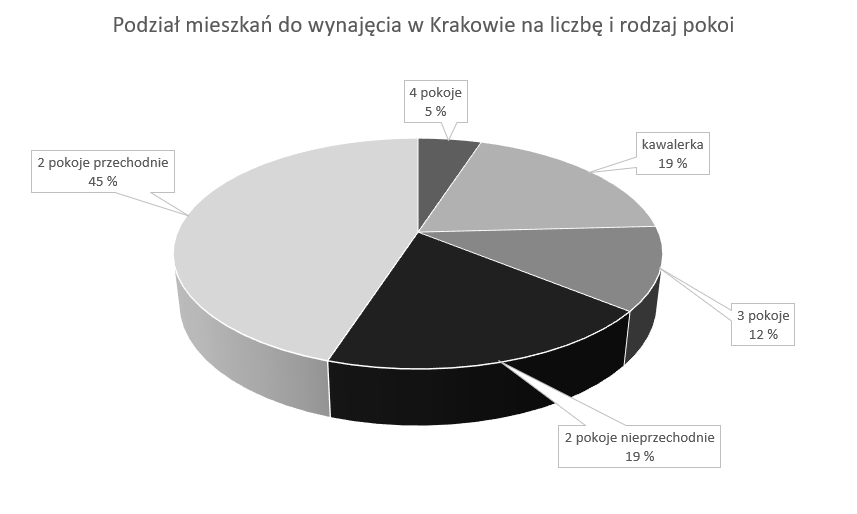
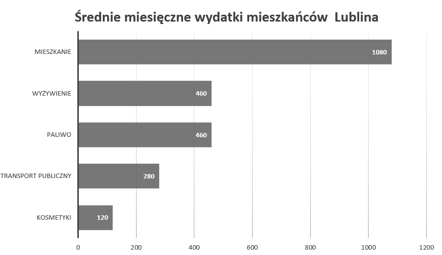

<style>
body {
text-align: justify}
</style>

```{r setup, include = FALSE, echo = FALSE}
knitr::opts_chunk$set(echo = TRUE)
```
## Zadanie

Zadanie polegało na przeprowadzeniu eksperymentu badającego umiejętność czytania wykresów przez odbiorców. Eksperyment miał sprawdzić, w jakim stopniu jest możliwe manipulowanie przekazem prezentowanym na wykresie, bez przekłamywania liczb, a jedynie za pomocą doboru techniki wizualizacji, kolorystyki i innych parametrów graficznych.


## Eksperyment

### Eksperyment 1
Utworzony został wykres prezentujący (fikcyjne) dane liczbowe, opatrzony tytułem oraz opisem osi. Był to wykres kołowy, który miał wprowadzić czytelnika w błąd poprzez zastosowanie trzeciego wymiaru. Ponadto kolory wycinków koła zostały tak dobrane, aby małe wartości wydawały się większe i na odwrót.

Poniżej wykres.

{width=700px}

### Eksperyment 2
Wykres został utworzony z przeskalowanych danych z poprzedniego eksperymnentu. Był to wykres słupkowy, wykonany wzorcowo, bez żadnych manipulacji odbiorcą.

Poniżej wykres.

{width=700px}


## Ankieta

Przeprowadziłyśmy ankietę ([link](https://docs.google.com/forms/d/e/1FAIpQLSeu8o2Oe8g54ihPOxDwHKtDMIst1O3ULmSlPP2CWIPAnQ4fhg/viewform?fbclid=IwAR0X7FFPgbNr0ASfYv4H3O9vC5eKMEoq2BnmrKz9d-6xcDyyV6pNJpytFD0)) na próbie 94 osób zawierającą powyższe wykresy. Po obejrzeniu każdego z wykresów ankietowani mieli za zadanie odpowiedzieć na trzy proste pytania, które sprawdzały, czy dobrze odczytali wykres. Po każdym wykresie pytania były takie same (analogiczne), aby możliwe było porównanie odpowiedzi.

```{r, include=FALSE, out.width=100}
wykres <- function(dane, title, legend.row = 1){
  tmp <- as.data.frame(round(table(dane)/length(dane) * 100,0))
  tmp$cum <- cumsum(tmp$Freq)
  colnames(tmp)[1] <- "value"
  ggplot(tmp, aes(x=1, y= -Freq, fill = value)) +
    geom_col(width = 0.4)+
    geom_text(aes(y = cum-100 - (Freq/2), label = ifelse(Freq < 7, " ", paste0(Freq,"%")))) +
    ggtitle(title) +
    theme_bw() +
    theme(legend.position = "bottom",
          axis.text.x=element_blank(),
          axis.text.y=element_blank(),
          axis.title.x=element_blank(),
          axis.title.y=element_blank(),
          panel.border = element_blank(),
          panel.background = element_blank(),
          panel.grid.major = element_blank(),
          panel.grid.minor = element_blank(),
          axis.ticks.x=element_blank(),
          axis.ticks.y=element_blank(),
          legend.title = element_blank())+
    guides(fill = guide_legend(nrow = legend.row)) +
    scale_fill_manual(values = c("#a6cee3", "#1f78b4", "#b2df8a", "#33a02c", "#fb9a99", "#e31a1c", "#fdbf6f"))+
    coord_flip()
  
}
```


```{r, echo = FALSE, warning = FALSE, message = FALSE, out.width = 800}
library(dplyr)
library(ggplot2)
library(plotly)
library(patchwork)
library(ggmosaic)

odp <- read.table('pd5_ankieta_odpowiedzi.csv', sep = ',', header = TRUE, stringsAsFactors = FALSE, encoding = "UTF-8")

order <- odp %>% group_by(Wykształcenie..obszar.naukowy.) %>% summarise(n()) %>% arrange(desc(`n()`)) %>% pull(Wykształcenie..obszar.naukowy.)
odp$Wiek <- as.numeric(odp$Wiek)

# p1 <- ggplot(aes(x=odp$Wykształcenie..obszar.naukowy.), data = odp) +
#   geom_bar() +
#   scale_x_discrete(limits = order) +
#   labs(x = "Wykształcenie - obszar naukowy", y = "Liczba respondentów") +
#   theme(axis.text.x = element_text(angle = 30, hjust = 1)) +
#   ggtitle('Przekrój respondentów ze względu na dziedzinę wykształcenia')
# 
p1 <- wykres(odp$Wykształcenie..obszar.naukowy., "Przekrój respondentów ze względu na dziedzinę wykształcenia", legend.row = 2)
p2 <- ggplot(aes(x=odp$Wiek), data = odp) +
  geom_bar() +
  labs(x = "Wiek", y = "Liczba respondentów") +
  theme(axis.text.x = element_text(hjust = 1)) +
  ggtitle('Przekrój wieku respondentów')

p1 / p2

```

## Wyniki ankiety

Poniżej prezentujemy wyniki uzyskane w ankiecie.

### Pytanie pierwsze: jakiego miasta dotyczyły dane?

```{r, echo = FALSE, warning = FALSE, message = FALSE, out.width = 800}

library(RColorBrewer)
coul <- brewer.pal(7, "Pastel2")


w1 <- wykres(odp$Z.jakiego.miasta.były.dane.o.mieszkaniach., "Wykres kołowy")
w2 <- wykres(odp$Średnie.miesięczne.wydatki.mieszkańców.jakiego.miasta.przedstawia.wykres., "Wykres słupkowy")
w1/w2

```

Pierwszym pytaniem jakie zostało zadane naszym ankietowanym dotyczyło miasta z jakiego pochodziły dane zamieszczone na wykresie. W pierwszym przypadku było to miasto Kraków, jak widzimy 90% odpowiedziało dobrze. Nastomiast w pytaniu do wykresu słupkowego zawarłyśmy pułakpę. Poprawną odpowiedzią było miasto Lublin, większość odpowiedziała Lubin, co oznacza, że ankietowani zwracają uwagę na tytuł, ale nie do końca uważnie go czytają.

### Pytanie 2: Porównanie dwóch wartości.

Przy wykresie kołowym pytałyśmy, czy liczba mieszkań z 2 pokojami nieprzechodnimi jest większa od liczby mieszkań z 3 pokojami. Natomiast przy wykresie słupkowym pytałyśmy, czy wydatki na wyżywienie były większe niż na transport publiczny.

```{r, echo = FALSE, warning = FALSE, message = FALSE, out.width = 800}

w1 <- wykres(odp$Czy.liczba.mieszkań.z.2.pokojami.nieprzechodnimi.była.większa.od.liczby.mieszkań.z.3.pokojami., "Wykres kołowy")


w2 <- wykres(odp$Czy.wydatki.na.wyżywienie.były.większe.niż.na.transport.publiczny., "Wykres słupkowy")
w1/w2

```

W obu pytaniach poprawna odpowiedzą jest "Tak". Zarówno w pytaniu do wykresu kołowego, jak i do wykresu słupkowego, wiekszość odpowiedziała poprawnie. 


### Pytanie 3: Czy którekolwiek dwie grupy były równoliczne?

```{r, echo = FALSE, warning = FALSE, message = FALSE, out.width = 800}

w1 <- wykres(odp$Czy.którekolwiek.dwie.grupy.były.równoliczne., "Wykres kołowy")

w2 <- wykres(odp$Czy.którekolwiek.dwie.grupy.były.równoliczne..1, "Wykres słupkowy")
w1/w2

```

Na koniec zapytałyśmy ankietowanych, czy są jakiekolwiek dwie grupy równoliczne. Odpowiedzią poprawną było "Tak". W przypadku wykresu słupkowego 91% ankietowanych odpowiedziało poprawnie. Analizując wyniki odpowiedzi z wykresu kołowego widzimy, że prawie połowa dała odpowiedź "Nie"", a 23% nie pamiętało. Niecałe 30% odpowiedziało poprawnie. Możemy wnioskować, że odczytywanie z wykresu kołowego jest dla odbiorców trudniejsze, przez co są podatni na manipulację. 

Podsumowując nasze eksperymenty i wyniki ankiety widzimy, że wykres kołowy nie jest najlepszym narzędziem do prezentacji wyników. Zwykły wykres słupowy jest zdecydowanie lepszym narzędziem.
