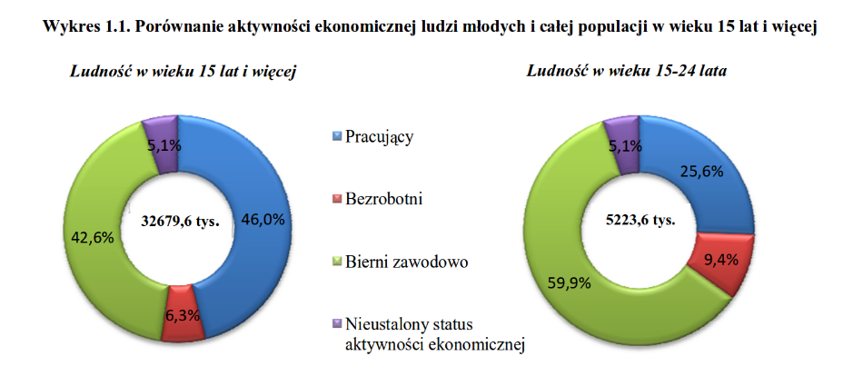

# Oryginał



# Nowa wersja

```{r echo=FALSE, fig.align="center", fig.width=8, fig.height=6}
library(ggplot2)

percent <- c(0.46, 0.063, 0.426, 0.051, 0.256, 0.094, 0.599, 0.051)
val <- rep(c(32679.6, 5223.6), each =4)
dat <- percent * val / 1000
dat[1:4] <- dat[1:4] - dat[5:8]
age <- rep(c("24 +", "15 - 24"), each = 4)
type <- rep(c("pracujacy", "bezrobotni", "bierni zawodowo", "nieustalony status"), times = 2)

ramka <- data.frame(age, type, dat)

ord <- order(ramka[age == "24 +",]$dat, decreasing = TRUE)
ggplot(data = ramka, aes(x = reorder(type, rep(ord,2)), y = dat, fill = age)) +
  geom_bar(stat = "identity", position = position_dodge()) +
  theme_light() + 
  xlab("Aktywnosc zawodowa") +
  scale_y_continuous(minor_breaks = c(1:20)) +
  ylab("Liczba osób (w milionach)") +
  guides(fill=guide_legend(title="Wiek")) 
```

