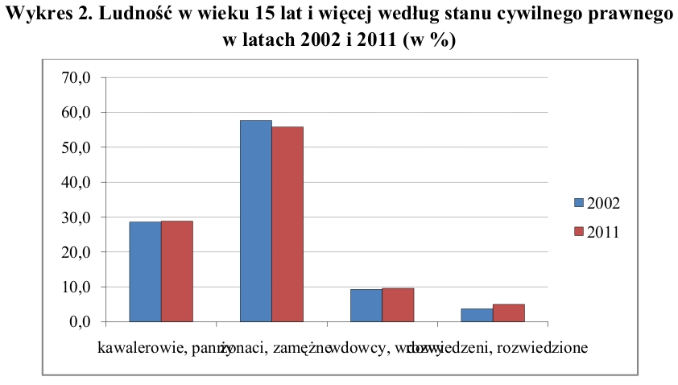

W tej pracy postanowiłem poprawić wykres z dokumentu "Ludność. Stan i struktura demograficzno-społeczna" bazującego na Narodowym Spisie Powszechnym Ludności i Mieszkań w 2011. Moją uwagę zwróciła szczególnie oś X, gdzie ticki są zapisane w&nbsp;sposób nieczytelny. Co więcej żadna z osi nie jest opisana, tak samo legenda.


Tak więc pierwsze co zrobiłem to obróciłem deliketnie ticki na osi X tak aby nie nachodziły one na siebie, ale jednocześnie były łatwe do odczytania i mieściły się na wykresie. Następnie ustawiłem je w taki sposób aby dana fraza wskazywała jednoznacznie na konkretną parę słupków. Na koniec dodałem labele osi X, osi Y, legendy.
```{r, echo=FALSE}
knitr::opts_chunk$set(echo = TRUE)
library(ggplot2)
library(reshape2)
options(stringsAsFactors = FALSE)
dane <- read.csv2(file = "dane_gov.csv")
dane <- dane[-nrow(dane),]
#colnames(dane) <- c("Stan cywilny prawny", "2002", "2011")
dane$Stan.cywilny.prawny <- factor(dane$Stan.cywilny.prawny, levels = dane$Stan.cywilny.prawny)
#ane <- dane[, !(names(dane) == "change")]
dane <- melt(dane, id.vars="Stan.cywilny.prawny")
dane$variable <- factor(dane$variable, levels=c("X2002", "X2011"), labels=c("2002", "2011"))
ggplot(data = dane, aes(x=Stan.cywilny.prawny, y=value, fill=variable)) +
  geom_bar(stat='identity', position='dodge') +
  scale_y_continuous(breaks = seq(0, 100, 10)) +
  labs(x = "Stan cywilny prawny", y = "% ludności w wieku 15 lat i więcej", fill = "Rok") +
  theme(axis.text.x = element_text(angle = 35, vjust = 1, hjust = 1, size = 10, face = "bold"), axis.text.y = element_text(face = "bold"), title = element_text(hjust = 0.5)) +
  ggtitle("Wykres 2. Ludność w wieku 15 lat i więcej według stanu cywilnego prawnego\n                                     w latach 2002 i 2011 (w %)")
```
