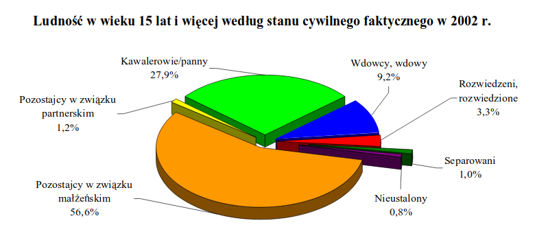

```{r setup, include=FALSE}
knitr::opts_chunk$set(echo = FALSE)
```

Na stronie GUS-u znalazłem pdf-a z następującym wykresem.
Gdyby nie procenty ciężko byłoby porównać pozostających w związku partnerskim z separowanymi i z nieustalonymi. Poza tym kawałki koła w dziwny sposób są oddalone od centrum nieproporcjonalnie według procentów. Dodatkowo wdowy, wdowcy są razem na wykresie mimo, że wdowców jest bardzo mało.


```{r wykres}
suppressMessages(library(ggplot2))
options(stringsAsFactors = TRUE)

ludnosc <- read.csv2('ludnosc.csv')

nazwy <- paste0(ludnosc$Mezczyzni,'\n',ludnosc$Kobiety)

ludnosc2 <- data.frame(ludzie=c(nazwy,nazwy),liczba=c(ludnosc$stanM,ludnosc$stanK),
                      to_fill=c(rep('Mezczyzni',length(nazwy)),
                             rep('Kobiety',length(nazwy))))

ggplot(data = ludnosc2, aes(x=ludzie,y=liczba,fill=to_fill)) +
  geom_col(position = position_dodge()) +
  labs(subtitle="Ludność w wieku 15 lat i więcej według \nstanu cywilnego faktycznego w 2002 roku") + 
  xlab('stan cywilny faktyczny') +
  ylab('liczba (w tysiącach)') +
  scale_fill_discrete(name="Płeć") +
  coord_flip()

```

W związku z tym zaproponowałem wykres słupkowy z podziałem na płcie i od razu widać na przykład, że wśród mężczyzn wdowców jest prawie tyle samo co rozwiedzonych, czego nie da się dowiedzieć z pierwszego wykresu. Również można zobaczyć, że jest więcej kawalerów niż pann i kobiet zamężnych niż żonatych mężczyzn co nie powinno mieć miejsca (powinna istnieć bijekcja między kobietami i mężczyznami w małżeństwie).