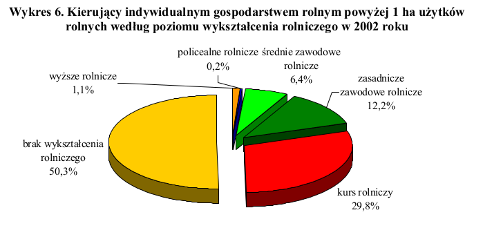

```{r setup, include=FALSE}
knitr::opts_chunk$set(echo = FALSE)
```
Na stronie GUS znalazłem publikację pt. "Ludność i gospodarstwa domowe związane z rolnictwem. Część I - Ludność" (http://stat.gov.pl/spisy-powszechne/narodowe-spisy-powszechne/powszechny-spis-rolny-2002/ludnosc-i-gospodarstwa-domowe-zwiazane-z-rolnictwem-czesc-i-ludnosc,2,1.html), w której występował taki wykres:


Dane z powyższego wykresu są przedstawione w nieprawidłowy sposób, ponieważ wykres kołowy(tortowy) utrudnia porównywanie ze sobą poszczególnych kategorii, a przedstawienie go w 3D powoduje, że części "oddalone" od odbiorcy wydają się mniejsze. Zdecydowanie lepszym sposobem na przedstawienie tych danych jest wykres słupkowy posortowany ze zwględu na dane procentowe, gdyż umożliwia on łatwe porównywanie kategorii.

```{r, fig.cap="Poprawiony wykres"}
library(ggplot2)
dane <- data.frame(wykształcenie = c("wyższe rolnicze", "policealne rolnicze", "średnie zawodowe rolnicze", "zasadnicze zawodowe rolnicze", "kurs rolniczy", "brak wykształcenia rolniczego"), odsetek = c(1.1,0.2,6.4,12.2,29.8,50.3))
dane$wykształcenie <- factor(dane$wykształcenie, levels = dane$wykształcenie[order(dane$odsetek)])
ggplot(data = dane, aes(x=wykształcenie, y=odsetek, label = paste0(odsetek, "%"), fill = wykształcenie)) +
  geom_col(show.legend = FALSE) +
  geom_text(hjust = -0.5) +
  scale_y_discrete(limits = seq(0,50,10),expand = expand_scale(add = c(0,9))) +
  labs(title = "Kierujący indywidualnym gospodarstwem rolnym \npowyżej 1 ha użytków rolnych \nwedług poziomu wykształcenia rolniczego w 2002 roku")  +
  coord_flip()
```
