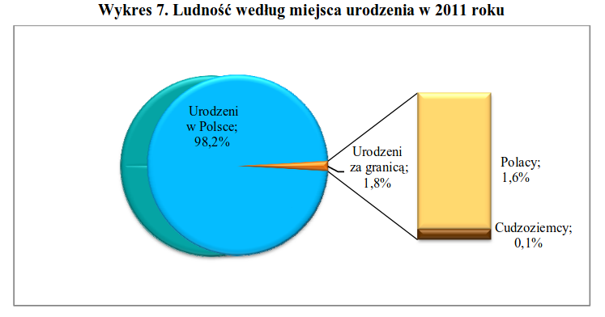

```{r setup, include=FALSE}
knitr::opts_chunk$set(echo = TRUE)
```

### Oryginalny wykres

```{r, echo=FALSE, out.width = '100%'}

```

### Przekształcony wykres

```{r, echo=FALSE}
library(ggplot2)
```

```{r pressure, echo=FALSE}
data <- data.frame(miejsce = c("Urodzeni w Polsce", "Polacy urodzeni za granicą", "Cudzoziemcy"), odsetek = c(98.2, 1.6, 0.1))

ggplot(data = data, aes(x = reorder(miejsce, -odsetek), y = odsetek, label = odsetek)) +
  geom_bar(stat = "identity", fill = "#5bc3eb") +
  geom_text(vjust = -0.7) +
  scale_y_continuous(breaks = seq(0, 100, 20), , expand = c(0, 6)) +
  labs(x = "", y = "Odsetek", title = "Ludność według miejsca urodzenia w 2011 roku") +
  theme_minimal()
```