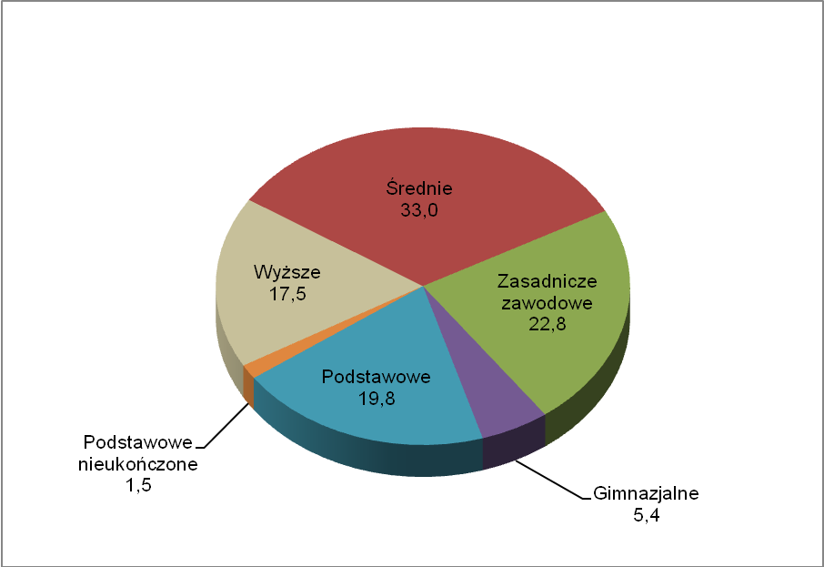

```{r setup, include=FALSE}
knitr::opts_chunk$set(echo = TRUE)
library(ggplot2)
```

```{r include=FALSE}
df <- data.frame(wyksz=c("Średnie", "Zasadnicze zawodowe", "Podstawowe", "Wyższe", "Gimnazjalne", "Brak"),
                 wartosc=c(33, 22.8, 19.8, 17.5, 5.4, 1.5))
df
```

Poniższy wykresy przedstawiają poziom wykształcenia ludności w 2011r

### Przed



### Po 
```{r echo=FALSE}
ggplot(data = df, aes(x = reorder(wyksz, -wartosc), y=wartosc, fill = "#756bb1")) +
  geom_bar(stat="identity") +
  geom_text(aes(label=wartosc), vjust=-0.5,
            position = position_dodge(0.9), size=3.5)+
  theme_minimal() + 
  theme(legend.position="none", axis.text.x = element_text(angle = 45, hjust = 1)) + 
  labs(x="Wykształcenie", y="Procent populacji", title="Wykształcenie ludności w 2011r")

```