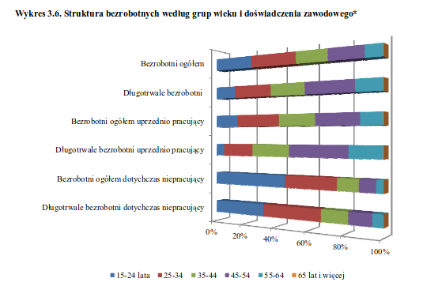

```{r setup, include=FALSE}
knitr::opts_chunk$set(echo = TRUE)
```


```{r include=FALSE}
library(ggplot2)
library(knitr)
library(dplyr)
```
```{r warning=FALSE, echo=FALSE, out.width = "100%"}


# załadowanie danych
data <- read.csv(file="dane_gus.csv", header=TRUE, stringsAsFactors = FALSE,sep=";")
data$wiek <- factor(data$wiek, levels = unique(data$wiek))

labels <- c("Bezrobotni ogółem", "Długotrwale bezrobotni", "Bezrobotni ogółem uprzednio pracujący", "Długotrwale bezrobotni uprzednio pracujący","Bezrobotni ogółem dotychczas niepracujący","Długotrwale bezrobotni dotychczas niepracujący")

# wyświetlenie wykresu
ggplot(data = data, aes(x = bezrobotni, y = procent, fill = wiek, width=0.7)) + 
  geom_bar(stat="identity") +
  labs(x = "", y = "Udział bezrobotnych (%)", title = "Struktura bezrobotnych według grup wieku") +
  theme(legend.position = "bottom", plot.title = element_text(size=11, colour="gray17")) +
  scale_fill_brewer(palette="BrBG") +
  coord_flip()
```
