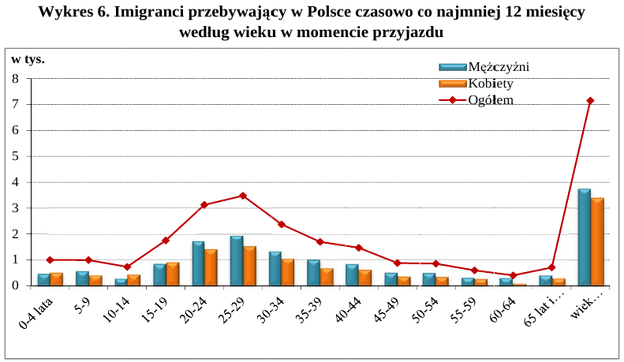

```{r setup, include=FALSE}
knitr::opts_chunk$set(echo = TRUE)
```

# Obrzydliwy wykres oryginalny



```{r, echo=FALSE, warning=FALSE, error=FALSE, results='hide', message=FALSE}
library(reshape2)
library(dplyr)
library(ggthemes)
library(ggplot2)

data <- read.csv('data_gus.csv')
data = melt(data)
levels(data$Wiek) = factor(c("0-4 lata",
  "5-9",
  "10-14",
  "15-19",
  "20-24",
  "25-29",
  "30-34",
  "35-39",
  "40-44",
  "45-49",
  "50-54",
  "55-59",
  "60-64",
  "65 +",
  "Nieznany wiek"))
levels(data$variable) = factor(c("Kobiety", "Mężczyźni"))

```

# Poprawiony piękny wykres
```{r, echo=FALSE}
ggplot(data, aes(x = Wiek, y = value, fill = variable)) +
  geom_col(position = 'stack') +
  ylab("Liczba imigrantów w tysiącach") + 
  scale_fill_manual(name="Płeć",values = c('firebrick1', "royalblue"))+
  #scale_fill_discrete(name="Płeć", )+
  theme_gdocs() +
  theme(axis.text.x = element_text(angle = 45, hjust = 1))
```


