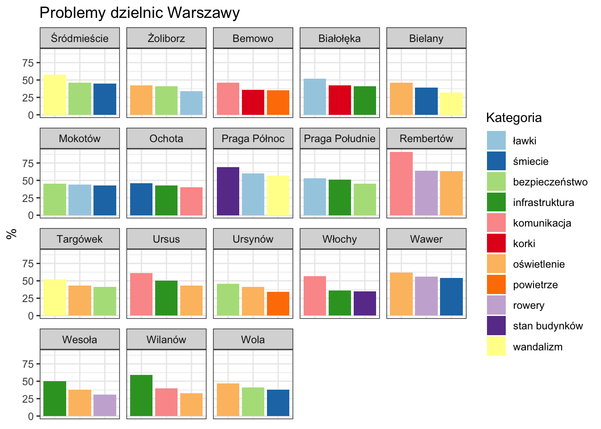

#Wykres "przed"

#Wykres "po""
```{R fig.height = 20, fig.width = 40, message=FALSE, results='asis'}
library(ggplot2)
library(dplyr)
library(RColorBrewer)
library(rCharts)
data = read.csv('pd1_problemy_warszawa.csv', 
                header = TRUE, sep = ";", encoding = "UTF-8", 
                stringsAsFactors=FALSE)
data$label = paste0(data$Kategoria, ' (', data$Procent, '%)')
p2 <- nPlot(Procent ~ Dzielnica, data = data, type= 'multiBarChart', group='Kategoria')
p2$show('inline', include_assets = TRUE, cdn = FALSE)
```

* Nowy wykres jest większy, co pozwala na lepsze zaprezentowanie danych

* Ułożenie wykresów w jednej osi ze wspólną skalą pozwala na łatwiejsze porówanie wartości pomiędzy poszczególnymi dzielnicami

* Dodanie etykiet na slupkach ułatwia rozpoznanie na pierwszy rzut oka jakie były problemy w każdej z dzielnic

* Słupki na nowym wykresie są łatwiej rożróżnialne, dzięki dobraniu odpowiedniej palety kolorów z pakietu RColorBrewer

* Dzięki ciemnemu tematowi łatwiej zauważyć granice pomiędzy poszczególnymi wykresami